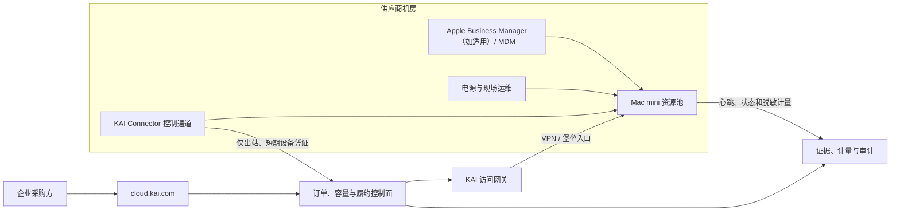
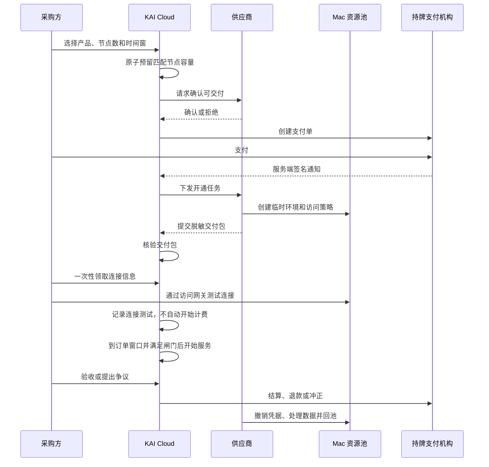

# KAI Cloud Mac mini 算力上架试点白皮书

## v1.0 评审版

**项目名称：** KAI Apple Silicon 专用节点试点  
**发布日期：** 2026 年 8 月 6 日  
**文件状态：** 内部评审，未授权公开销售  
**试点范围：** 中国境内企业客户，首批 10 台可售节点、2 台故障替换节点  
**拟扩展规模：** 验收通过后扩展至 100 台 Mac mini 资源池

> 本白皮书用于产品、技术、运营、法务、财务和合作机房共同评审。本文不构成 Apple 授权、法律意见、许可结论、收益承诺或正式服务协议。Apple、Mac、Mac mini、macOS、Xcode、Metal 等名称及商标归其权利人所有；KAI Cloud 不因本试点当然成为 Apple 的代理商、合作伙伴或认证服务商。

---

## 摘要

本试点拟把机房中闲置的 Mac mini 从“100 台硬件”转化为可在 cloud.kai.com 上核验、上架、预留、远程交付、计量、验收和结算的企业计算服务。

首期不把 Mac mini 描述为 NVIDIA GPU，也不使用 GPU 小时计价。Mac mini 是包含 CPU、Apple GPU、神经网络引擎、统一内存、SSD 和 macOS 的完整物理节点，首期标准商品定义为：

> **KAI Apple Silicon 专用节点：客户在约定时间内独占一台经过验真的实体 Mac mini，通过安全网络使用 SSH 或 macOS 图形桌面。**

试点采用“一台物理节点对应一个并行单位”的容量模型：

```text
节点容量时 = 已锁定物理节点数 × 连续服务秒数
节点小时 = 节点容量时 ÷ 3,600
```

客户购买的是具体订单中的节点使用权，不取得可转售余额，不取得设备所有权，也不取得与 Apple 相关的授权或品牌权利。

本白皮书比较三种可能的商品形态：

1. **独占 Mac mini 节点**：整机远程租用，作为首期唯一正式试点商品；
2. **macOS CI 构建节点**：按 Runner 小时或构建分钟提供自动编译，作为第二阶段候选；
3. **Apple Silicon 推理节点**：按模型实例或接口提供推理，作为完成实测后的实验候选。

试点先选择 12 台同规格或可清晰分组的设备，其中 10 台进入可售池，2 台作为故障替换和维护储备。只有主体、许可、Apple 软件使用方式、机房责任、数据安全、远程交付和结算路径全部确认，并且技术验收通过后，才允许从测试订单进入受控商业订单。

---

## 第一章　为什么做这个试点

### 1.1 问题不是机器闲置，而是机器尚未成为商品

一台通电、联网的 Mac mini 还不能直接成为可交易算力。客户真正需要的是一份写清楚以下内容的服务：

- 芯片、内存、存储、网络和系统版本；
- 哪个地区、什么时间可以使用；
- 是否独占，是否允许管理员权限；
- 通过什么方式连接；
- 能否运行 Xcode、CI、Metal、Core ML 或 MLX；
- 如何判断交付成功；
- 故障后多久响应、是否替换；
- 如何计量、退款、验收和结算；
- 订单结束后如何撤销凭据和处理客户数据。

因此，本试点的任务不是发布一张“有 100 台 Mac mini”的广告，而是建立一条可验证的服务链路。

### 1.2 KAI Cloud 的价值

KAI Cloud 在试点中负责：

- 把异构设备归一为不可变的标准产品版本；
- 核验供应商主体、资源归属、设备规格和可交付状态；
- 维护每台物理节点的时间窗，防止同一节点重复出租；
- 把价格、交付方式、SLA 和验收规则冻结到订单；
- 安全传递连接信息，不在普通页面保存长期密码或私钥；
- 记录开通、连接测试、服务开始、故障、计量、验收和结算证据；
- 在受控边界内协调客户、供应商和机房。

KAI Cloud 首期不负责：

- 宣称 Apple 官方合作或认证；
- 把 Mac mini 等同于 CUDA GPU；
- 承诺未经测试的模型速度；
- 发行可转让的“节点时余额”；
- 未经评估提供多人共享 macOS 虚拟机；
- 代客户保管个人 Apple Account、长期签名私钥或明文开发者证书；
- 绕过电信、机房、软件许可、数据和税务方面的正式确认。

### 1.3 试点假设

本项目需要验证五个假设：

1. 企业客户愿意为可远程使用的独占 Apple Silicon 节点付费；
2. Mac mini 可以在机房环境中被稳定地批量注册、监控、开通和回收；
3. 设备规格、在线状态和订单时间窗可以被 KAI 持续验真；
4. 独占节点能够比多人共享方案更快形成安全、清晰的首笔交易；
5. 实际订单数据能够证明后续是否值得发展 CI 和模型推理服务。

---

## 第二章　试点目标与验收指标

### 2.1 总目标

在不破坏 cloud.kai.com 现有 GPU、Token、模型、NAS 和机柜交易能力的前提下，新增一种独立的物理产品类别，跑通：

```text
供应商入驻
→ Mac 资产申报
→ 设备验真
→ 节点时间窗入账
→ 上架
→ 客户下单
→ 容量预留
→ 供应商确认
→ 安全远程交付
→ 连接测试
→ 服务计量
→ 验收
→ 结算或退款演练
→ 数据清理与节点回池
```

### 2.2 30 天试点目标

下表是试点目标，不是对外 SLA：

| 维度 | 30 天目标 |
|---|---|
| 资源 | 12 台纳管，10 台可售，2 台备用 |
| 验真 | 10 台可售节点全部形成不可变验真报告 |
| 心跳 | 可售节点管理心跳覆盖率不低于 99% |
| 客户 | 至少 3 家企业设计伙伴完成主体确认 |
| 订单 | 至少 5 笔完整测试或受控商业订单 |
| 使用 | 累计完成不少于 500 个已验收节点小时 |
| 交付 | 首次连接测试成功率不低于 95% |
| 故障 | 至少完成 1 次故障替换演练 |
| 回收 | 结束订单的凭据撤销和清理证据覆盖率 100% |
| 账本 | 超卖事件为 0，容量与订单勾稽差异为 0 |
| 安全 | 明文长期凭据泄露、跨客户数据读取事件为 0 |

### 2.3 进入 100 台扩容的门槛

只有同时满足以下条件，才允许扩展：

- 首批试点目标达到或有经批准的书面豁免；
- 至少一笔订单完成下单、开通、使用、验收和结算闭环；
- 退款、故障替换和数据清理演练通过；
- 机房、供应商、平台、销售、发票和客户数据责任已书面明确；
- Apple 软件使用和第三方软件许可已经按实际产品形态审阅；
- 生产认证、支付、网络、密钥管理和审计方案已专项验收；
- 未发生超卖、凭据泄露、账本不平或无法证明数据已处理的事件。

---

## 第三章　三种产品是什么

### 3.1 产品 A：独占 Mac mini 节点

客户购买一台实体 Mac mini 在约定连续时间窗内的独占使用权。客户可以通过 SSH 运行命令，也可以在授权范围内使用 macOS 图形桌面。

适用客户：

- iOS、macOS、visionOS 软件开发团队；
- 需要 Xcode、Simulator 或 Apple Silicon 原生环境的企业；
- 需要远程 Mac 开发桌面的团队；
- 需要在 Apple Silicon 上运行 Metal、Core ML、MLX 或兼容软件的项目；
- 需要独占环境、无法接受共享 Runner 的客户。

首期交付方式：

```text
专用网络入口 + 临时本地账户 + SSH
可选：受控的 macOS 屏幕共享或远程管理
```

### 3.2 产品 B：macOS CI 构建节点

客户购买的不是桌面，而是一条自动化构建能力。代码平台把构建任务发送到 Mac mini，节点拉取代码、执行编译和测试，再返回日志及产物。

典型流程：

```text
代码提交
→ CI 调度
→ 临时工作目录
→ Xcode 编译与测试
→ 产物上传
→ 工作目录清理
```

候选计价单位：

- `CI_RUNNER_HOUR`：一个专用 Runner 的占用小时；
- `BUILD_MINUTE`：实际执行构建的分钟数；
- `CONCURRENT_RUNNER_MONTH`：一个月内保留的并发槽位。

本产品需要额外解决代码仓库授权、缓存隔离、开发者证书、签名密钥、构建产物、第三方依赖和失败重试，因此不作为首笔订单的默认商品。

### 3.3 产品 C：Apple Silicon 推理节点

供应商在 Mac mini 上部署经过确认的模型与推理服务，客户通过 API 获得输出。客户可以购买独占模型实例、预留吞吐或实际用量，而不是购买一个模糊的“AI 算力”。

候选实现包括：

- 基于 Metal、Core ML、MLX 或兼容运行时的模型实例；
- 企业内网知识库或私有推理端点；
- 文本生成、Embedding、语音、图像或视频处理服务。

只有完成以下验证，才允许创建可售商品：

- 模型身份、版本、量化方式和商业许可明确；
- 具体芯片和统一内存能够承载目标模型；
- 首 Token 延迟、吞吐、并发、错误率和稳定性有真实数据；
- Token 或请求计量能与网关和节点日志对账；
- 与 GPU 云或公开模型 API 比较后仍有明确客户价值。

### 3.4 试点选择

| 方向 | 价值 | 复杂度 | 首期决定 |
|---|---|---|---|
| 独占节点 | 交付清晰、需求容易理解 | 中 | 正式试点 |
| CI 构建 | 标准化程度高、可能提高利用率 | 中高 | 预留扩展 |
| 模型推理 | 可按实例或用量销售 | 高 | 仅做 Benchmark |

本试点的正式成功标准只依据独占节点，不用未经验证的 CI 或推理数据证明项目成功。

---

## 第四章　标准商品定义

### 4.1 新增产品代码

现有 cloud.kai.com 的 `GPU_COMPUTE` 使用 GPU 小时，不适合描述完整的 Apple Silicon 设备。试点建议新增：

| 字段 | 建议值 |
|---|---|
| `productCode` | `DEDICATED_COMPUTE_NODE` |
| `rateUnitCode` | `NODE` |
| `pricingUnitCode` | `NODE_HOUR` |
| `fulfillmentModel` | `DEDICATED_MAC_NODE` |
| 容量公式 | `rateUnits × durationSeconds` |
| 计价分母 | 每节点小时 3,600 个基础单位 |

`DEDICATED_COMPUTE_NODE` 不等于 GPU，不得把容量写入 `capacity_gpu_seconds`，不得复用 GPU 型号、显存、CUDA 或卡数语义。

### 4.2 不可变产品版本

每种硬件规格和交付镜像形成独立、不可变的产品版本。例如：

```text
产品版本：Apple Mac mini / M4 Pro / 48 GB / 1 TB / 10GbE / v1
芯片系列：Apple M4 Pro
统一内存：48 GB
本地存储：1 TB SSD
网络接口：10Gb Ethernet
架构：arm64
交付系统：经批准的 macOS 版本
镜像档位：基础环境 / Xcode 环境
计价单位：节点小时
交付形态：整机独占
```

芯片、内存、存储、网络或基准镜像发生影响交易的变化时，建立新版本，不覆盖已经成交订单。

### 4.3 公开产品卡

公开页面至少展示：

- 产品名称和版本；
- 芯片、统一内存、存储、网络接口；
- 脱敏区域；
- 可用连续时间窗；
- 当前可售并发节点数；
- 最短租期和计价单位；
- SSH、图形桌面或 CI 等交付方式；
- 最近一次验真时间；
- 开通时限、替换规则、数据清理规则；
- 价格是否含税、网络和存储；
- 明确的不适用任务。

公开页面不得展示：

- 完整设备序列号；
- 机房详细位置、管理网地址；
- MDM、供应商后台或连接器凭据；
- 供应商底价和竞争性原始报价；
- 客户账户、代码、模型、证书或任务信息。

### 4.4 示例挂牌

> **KAI Apple Silicon 专用节点｜M4 Pro 48 GB**  
> 架构：arm64｜整机独占｜节点小时计价  
> 交付：专用网络入口＋SSH；图形桌面按订单开放  
> 适用：Xcode 开发、Apple Silicon 测试、Metal/MLX 实验  
> 不适用：CUDA、依赖 NVIDIA 驱动或多卡互联的任务  
> 状态：已验真｜可售数量和时间以订单页为准  
> 价格：受控试点询价；最终价格、税费和 SLA 以不可变订单快照为准

---

## 第五章　供应商和设备准入

### 5.1 供应商材料

供应商至少提交：

- 企业主体、授权经办人和联系信息；
- 对公账户、开票信息和合同签署权限；
- 设备采购、所有权、租赁权或合法运营证明；
- 机房托管合同和实际运维责任；
- 相关业务许可或持证合作方材料；
- 网络、供电、消防、安全、值守和故障响应说明；
- Apple 软件、Xcode、第三方软件和模型使用的内部合规确认；
- 客户数据处理、日志、备份、擦除和事故响应制度。

### 5.2 批量资产清单

100 台设备通过模板导入，不要求供应商逐台创建挂牌。每台设备形成一个 `resource_asset`：

| 字段 | 说明 |
|---|---|
| `supplierAssetId` | 供应商内部唯一编号 |
| `serialDigest` | 序列号摘要，不公开原文 |
| `modelIdentifier` | Apple 型号标识 |
| `chipFamily` | M1/M2/M3/M4/M5 及档位 |
| `cpuCores` | CPU 核心信息 |
| `gpuCores` | Apple GPU 核心信息 |
| `neuralEngine` | 神经网络引擎信息 |
| `unifiedMemoryGiB` | 统一内存 |
| `storageGiB` | 本地 SSD 容量 |
| `networkProfile` | 网络接口和可交付带宽档位 |
| `osVersion` | 当前 macOS 版本 |
| `imageProfile` | 基础/Xcode/推理实验镜像 |
| `regionCode` | 脱敏区域编码 |
| `rackPositionPrivate` | 私有机位信息 |
| `mdmStatus` | MDM 纳管状态 |
| `connectorStatus` | KAI Connector 状态 |
| `maintenanceClass` | 维护与备用分类 |

### 5.3 分组原则

不同芯片、内存、存储、网络或镜像的机器不能混成一个产品版本。建议按以下层级分组：

```text
区域
└─ 芯片系列与档位
   └─ 统一内存
      └─ 存储与网络
         └─ 镜像版本
```

每一组形成独立资源池和容量批次。某组只有 8 台，就只能发布最多 8 个同时可用的节点，不能借用另一规格的设备补足后继续按原规格交付。

---

## 第六章　机房与设备基础条件

### 6.1 必备条件

首批试点节点至少满足：

- 有线网络接入，不以消费级 Wi‑Fi 作为生产主链路；
- 管理网络与客户工作网络分区；
- 稳定供电、机房温控和设备固定；
- 可识别设备编号、网口和电源位置；
- 有远程或现场故障处理人员；
- 有可控制的电源恢复方案和备用节点；
- 有设备重装、恢复和必要的现场维护流程；
- 有客户网络访问和日志留存边界。

### 6.2 Mac mini 的机房特殊性

Mac mini 不是传统带完整 BMC/IPMI 的服务器。机房应补充：

- 智能 PDU 或受控电源；
- 断电恢复和无法远程登录时的现场处置；
- 必要的恢复机、显示/输入或 Apple Configurator 运维能力；
- 不依赖客户账户的管理身份；
- 备用设备和可验证的替换流程。

供应商不能只承诺“机器在线”。平台需要证明断电、系统失败、网络中断和订单结束时均有处理路径。

### 6.3 初始资源配置

100 台设备建议在试点后采用：

| 用途 | 初始数量 | 说明 |
|---|---:|---|
| 独占节点可售池 | 60 | 首要商品，按规格继续拆池 |
| CI 候选池 | 20 | 未通过 CI 专项验收前不公开销售 |
| 推理实验池 | 10 | 用于模型 Benchmark，不发布泛化性能承诺 |
| 备用与维护池 | 10 | 故障替换、升级、恢复和返修 |

这个分配不是永久比例。扩容应依据真实订单、价格、故障和利用率数据按月调整。

---

## 第七章　技术架构

### 7.1 总体架构



### 7.2 三个控制面

1. **Apple 设备管理面**：通过适用的组织设备注册方式和 MDM 完成设备纳管、配置、策略、系统更新和远程处理；
2. **KAI 交易与履约面**：管理资源、验真、容量、订单、交付、计量、验收和结算；
3. **客户访问面**：通过隔离网络提供 SSH、图形桌面、CI Runner 或未来的推理 API。

Apple Business Manager 是否可用于供应商主体、地区和现有设备，以及采用自动注册还是受控人工注册，应在阶段 0 逐项确认。MDM 不代替 KAI 容量账本，KAI 也不代替供应商的设备管理责任。

### 7.3 KAI Connector

连接器以系统服务运行，并通过设备身份和短期证书主动连接 KAI。它可以上报：

- 设备指纹摘要和产品版本匹配结果；
- 在线、启动、系统版本和安全基线状态；
- CPU、内存、磁盘、网络和授权的 Apple GPU 指标；
- 当前是否可接受订单；
- 订单对应的临时环境是否已经准备；
- 服务区间、故障和清理结果的证据摘要。

连接器不得默认读取：

- 客户代码、文档、模型和输入输出内容；
- 客户 Apple Account 密码；
- 客户签名私钥和长期访问 Token；
- 与验真、计量和安全无关的文件内容。

### 7.4 状态模型

物理节点建议使用：

```text
REGISTERED
→ PENDING_VERIFICATION
→ VERIFIED
→ AVAILABLE
→ HELD
→ PROVISIONING
→ TESTABLE
→ IN_SERVICE
→ WIPING
→ AVAILABLE
```

异常分支：

```text
任何可运行状态
→ QUARANTINED / MAINTENANCE
→ REVERIFICATION
→ AVAILABLE 或 WITHDRAWN
```

节点状态、订单状态、交付状态和计量状态分别保存。前端不能因为“能 SSH”就自动认定开始计费或完成验收。

---

## 第八章　资源验真

### 8.1 验真层级

每台节点至少通过四层验证：

1. **主体和归属验证**：谁有权把这台设备承诺给订单；
2. **硬件身份验证**：型号、芯片、内存、存储和网络是否一致；
3. **可交付验证**：能否创建隔离账户、远程连接、执行测试并回收；
4. **持续状态验证**：心跳是否新鲜，配置是否漂移，是否已经被占用或维护。

### 8.2 标准测试

试点测试应包含：

- 系统与硬件信息采集；
- CPU 和内存稳定性测试；
- 本地磁盘读写与空间检查；
- 内外网连通、时延、吞吐和丢包测试；
- SSH 登录、SFTP 传输和会话终止测试；
- 图形桌面按需测试；
- Xcode 镜像的版本和示例项目构建测试；
- Metal/MLX 实验镜像的标准模型测试；
- 连续心跳和重启恢复测试；
- 临时账户创建、禁用、删除和清理验证。

平台不以一次截图代替持续验真。关键配置变化、心跳中断、系统升级、硬件更换或失败率异常时，节点暂停接受新订单并进入复验。

### 8.3 验真报告

报告至少记录：

- `verificationRunId`；
- 产品版本及设备摘要；
- 测试工具、版本和参数；
- 开始、结束时间及执行主体；
- 测试结果和原始证据摘要；
- 通过、拒绝或受限结论；
- 有效期和触发复验的条件。

报告只追加新版本，不覆盖历史结论。

---

## 第九章　容量批次与防超卖

### 9.1 物理单位

一个 `NODE` 是一台满足订单产品版本的物理 Mac mini。对于整机独占商品，一台机器在同一时间只能属于一个有效订单。

容量必须同时满足：

- 节点规格匹配；
- 节点在完整订单时间窗可用；
- 同一时间片所有有效预留不超过资源池并行节点数；
- 节点没有处于维护、清理、复验或风险冻结状态。

### 9.2 容量公式

```text
capacityBaseUnits = rateUnits × durationSeconds
NODE_HOUR = capacityBaseUnits ÷ 3,600
```

客户提交并行节点数和 UTC 起止时间，节点小时由服务端派生。客户不能直接提交成交总节点小时或成交金额。

### 9.3 100 台规模示例

若 100 台中保留 10 台作为备用，90 台进入可售池，则一个 30 天月份的理论容量为：

```text
90 × 24 × 30 = 64,800 节点小时
```

这是理论上限，不是可出售的代币余额。维护窗口、已确认订单、故障、升级和风险冻结必须从具体时间窗中扣除。

### 9.4 不变量

1. 未通过且仍有效的验真不能上架；
2. 同一物理节点不能同时履行两笔重叠订单；
3. 不同产品版本不能静默替换；
4. 下单、预留、容量转移和事件必须原子提交；
5. 已成交容量不能被供应商取出；
6. 迟到支付不能复活已经过期并分配给他人的节点；
7. 故障替换必须记录原节点、替换节点、时间和原因；
8. 所有容量变化使用追加事件或冲正，不覆盖历史事实。

---

## 第十章　上架流程

### 10.1 供应商操作路径

```text
供应商合作申请
→ 企业与机房审核
→ 批量导入设备
→ MDM 与 Connector 配对
→ 创建验真任务
→ 形成产品版本和资源池
→ 划分连续容量批次
→ 设置价格、起订量、SLA 和交付方式
→ KAI 运营复核
→ 发布不可变挂牌版本
```

### 10.2 建议新增页面

- `/supplier/mac-nodes`：Mac 节点资产和健康状态；
- `/supplier/mac-pools`：按规格分组的资源池；
- `/supplier/mac-listings`：节点时挂牌、暂停和取出；
- `/ops/mac-verification`：KAI 验真队列；
- `/ops/mac-delivery`：开通、连接测试、替换和清理；
- `/resources/apple-silicon`：公开产品目录；
- `/buyer/orders/[id]`：订单时间线、连接领取、验收和争议。

页面名称可以调整，但后台对象和权限边界不能只靠前端文字区分。

### 10.3 挂牌字段

供应商填写：

- 产品版本和资源池；
- 可售开始、结束及维护窗口；
- 最大并发节点数；
- 最短租期和是否允许续租；
- 节点小时或派生日/月价格；
- 含税、网络、存储和软件范围；
- SSH、图形桌面或受控 Runner 交付方式；
- 预计开通时间；
- SLA、替换、取消、退款和数据处理规则；
- 报价有效期。

订单创建时冻结挂牌版本，供应商后续改价不影响已成交订单。

---

## 第十一章　订单与交付

### 11.1 完整流程



### 11.2 交付包

交付包只保存完成连接所需的最小信息：

- 访问网关地址或专用网络配置；
- 脱敏节点标识；
- 临时用户名或一次性领取方法；
- SSH 主机指纹；
- 图形桌面是否开放；
- 测试命令和验收步骤；
- 凭据过期时间；
- 支持和事故联系人。

供应商不得在普通表单提交明文长期密码、私钥、Apple Account 密码或客户签名证书。买方通过一次性领取或采购方公钥保护的方式取得短期凭据。

### 11.3 连接测试不等于验收

连接测试只证明：

- 网络路径可达；
- 身份认证成功；
- 节点指纹和订单一致；
- 基础测试命令可执行。

它不自动证明完整服务窗口已经开始、性能全部达标、订单已经完成或供应商可以结算。

---

## 第十二章　远程访问设计

### 12.1 三种访问方式

| 方式 | 适用场景 | 客户体验 |
|---|---|---|
| SSH/SFTP | 命令行、构建、传文件、运行服务 | 使用终端或 CI 工具 |
| macOS 图形桌面 | Xcode、Simulator、GUI 软件 | 远程查看和控制桌面 |
| 任务/API | CI 或推理服务 | 提交任务或调用接口，不登录系统 |

Apple 官方文档说明 macOS 可以开启 Remote Login，通过 SSH/SFTP 接入；屏幕共享可以远程查看和控制桌面，并与 VNC 兼容。组织设备也可以通过 MDM 启用 Remote Management。

### 12.2 网络原则

生产服务不把所有 Mac mini 的 22、5900 等端口直接暴露到公网。推荐路径：

```text
客户身份认证
→ 企业 VPN / 零信任访问
→ KAI 或供应商堡垒入口
→ 订单绑定节点
```

至少实施：

- 每个订单独立账户或独立凭据；
- 限定来源、目标节点和有效期；
- SSH 主机指纹校验；
- 登录、领取、失败和撤销记录；
- 订单结束自动禁用账户和网络策略；
- 管理面、客户面和监控面分离；
- 不允许客户访问其他节点或机房管理网。

### 12.3 图形桌面边界

- 屏幕共享与 Remote Management 采用经批准的一种管理模式；
- 是否允许剪贴板、文件传输、USB、音频或管理员权限写入订单；
- 图形桌面只能通过受控网络开放；
- 供应商管理人员进入客户会话必须有工单、理由和审计；
- 默认不允许个人 Apple Account、iCloud 或查找功能绑定到节点。

---

## 第十三章　数据安全与节点回收

### 13.1 数据责任

订单必须明确：

- 客户上传什么数据；
- 供应商、KAI 和机房分别是否可能接触；
- 数据位于哪个区域；
- 是否备份、备份多久、由谁恢复；
- 日志包含什么、不包含什么；
- 订单结束如何导出和清理；
- 安全事件由谁通知、调查和补救。

### 13.2 隔离

首期采用整机独占，不在同一时段服务两个客户。每笔订单使用独立账户、工作目录和访问策略。供应商运维账户与客户账户分离，KAI 不使用一个通用管理员密码交付全部机器。

### 13.3 凭据

- 首选短期 SSH 证书或订单级密钥；
- 不在聊天、邮件正文或普通工单发送长期密码；
- 客户 Apple Developer 凭据由客户管理；
- CI 签名密钥使用客户控制的密钥库或短期注入；
- 领取码、凭据和 Token 不进入领域事件或普通日志；
- 过期、退款、争议和事故均能立即撤销访问。

### 13.4 回收和擦除

订单结束执行：

```text
停止客户任务
→ 客户确认数据导出窗口
→ 撤销网络和账户凭据
→ 删除客户账户与工作目录
→ 执行约定的清理或系统擦除
→ 验证无法使用旧凭据登录
→ 生成清理证据摘要
→ 重新验真
→ 返回 AVAILABLE
```

Apple 官方支持组织管理的 Apple Silicon Mac 通过设备管理执行远程擦除；实际使用何种擦除方式、是否需要完整重装以及证据标准，必须根据产品、系统版本和客户等级固化。

节点未形成清理证据时，不得重新分配给下一位客户。

---

## 第十四章　计量、SLA 与验收

### 14.1 计量原则

独占节点按“供应商已经分配并达到可用条件的服务时间”计量，不按客户 CPU 利用率计费。客户即使没有持续跑满，也占用了该物理节点和时间窗。

平台和供应商记录：

- 分配节点数；
- 订单 UTC 起止时间；
- 实际可用、不可用和未证明时间；
- 连接测试和服务开始时间；
- 心跳、网络、重启和故障事件；
- 替换节点及切换时间；
- 客户验收、争议和退款结果。

### 14.2 SLA 模板

每条挂牌必须写明：

- 预计开通时限；
- 服务可用性计算方法；
- 计划维护通知；
- 故障首次响应和替换时限；
- 网络、磁盘和环境承诺的测量口径；
- 客户软件、错误配置和第三方服务的排除边界；
- 数据导出和清理时限；
- 不可用时间的服务抵扣或退款方式；
- 自动验收期限和争议入口。

试点先记录实测数据，不在没有历史证据时对外承诺夸张可用率。

### 14.3 验收

采购方至少检查：

- 产品版本与订单一致；
- 能通过约定方式连接；
- CPU、统一内存、磁盘、系统和网络信息一致；
- 指定的样例任务可以执行；
- 管理权限和软件范围符合合同；
- 访问不到其他客户和管理网络；
- 故障和支持联系方式有效。

验收通过后订单才进入可结算状态。争议期间结算保持冻结。

---

## 第十五章　价格与商业模式

### 15.1 成本底价

供应商不能只用硬件采购价除以 720 小时。每节点小时成本至少包括：

```text
设备折旧
+ 机柜和机位
+ 电力和制冷
+ 网络与公网出口
+ MDM、监控和连接器
+ 运维和值守
+ 备用与故障准备金
+ 软件与合规成本
+ 平台服务费
÷ 预计可结算节点小时
```

预计可结算小时必须基于目标利用率，而不是假设每台机器每月 100% 出租。

### 15.2 首期报价

试点建议同时形成：

- 节点小时价格：用于比较和短期订单；
- 节点日价格：作为首期主要成交单位；
- 节点月价格：适合稳定开发团队；
- Xcode 镜像、额外存储、专用带宽和运维作为明确附加项。

日价和月价可以从节点小时派生，但订单结算仍按冻结的价格版本执行，不事后使用行情公式改价。

### 15.3 收入与结算

可能收入包括：

- 供应商的节点服务收入；
- KAI 的成交与履约服务费；
- 可选的验真、管理或企业采购服务费；
- 后续 CI 调度和推理网关的软件服务费。

平台不得依靠不透明价差同时扮演供应商、经纪人和价格裁判。收费主体、费率、税费、发票、退款和结算时间应在订单前明确。

---

## 第十六章　合规边界

### 16.1 电信与机房业务

《电信业务分类目录》将利用机房设施向用户提供服务器等设备出租、系统配置及管理，以及通过数据中心设备和资源提供按需使用、应用部署和运行管理等服务，纳入互联网数据中心业务和互联网资源协作服务的业务描述。

因此正式商业化前必须确定：

- 实际服务器出租和计算服务由谁提供；
- 该主体及机房是否具备适用资质或合规合作结构；
- KAI 是平台运营者、经纪服务商、销售主体还是交付主体；
- 客户合同、服务合同、发票和退款分别由谁承担；
- 是否还涉及在线数据处理与交易处理等其他许可评估。

试点不得仅凭“设备属于自己”推断可以直接通过互联网公开出租。

### 16.2 Apple 软件和开发工具

- 按设备实际安装和使用的 macOS 版本审阅对应 Apple 软件许可；
- 按实际用途审阅 Xcode、SDK 和 Apple Developer Program 条款；
- 不把 Apple 软件安装到非 Apple 品牌硬件；
- 不默认允许多人共享、转许可或商业虚拟化；
- 客户的开发者身份、证书和签名权限由客户负责；
- 使用 Apple 商标时避免暗示官方授权、认证或合作。

首期采用实体 Mac mini 整机独占，是为了降低隔离和履约复杂度，不代表自动获得任何软件许可结论。

### 16.3 客户数据

平台、供应商、机房和第三方管理服务商应分别确认：

- 个人信息和企业数据的处理目的、范围和期限；
- 客户代码、模型、输入输出和日志是否可能被访问；
- 数据安全责任、人员权限和事故响应；
- 数据删除、备份和证据保留；
- 境内订单是否发生跨境传输或远程境外访问。

首期原则上限定中国境内企业客户、境内节点和人民币交易。跨境客户、境外远程运维和跨境数据另行评估。

### 16.4 第三方软件和模型

供应商只可以预装有权提供的系统、开发工具、软件包和模型。客户上传的软件、代码、模型和数据由客户保证权利；平台仍需建立投诉、下架和事件处置流程。

---

## 第十七章　对 cloud.kai.com 的技术改造

### 17.1 数据模型

新增或扩展：

- `capacity_product_version`：支持 `DEDICATED_COMPUTE_NODE`；
- `resource_asset`：支持单台物理 Mac 和资源池；
- `verification_run`：增加 Apple Silicon、系统、网络和远程交付证据；
- `capacity_lot`：使用 `NODE` 并行单位和连续时间窗；
- `listing_version`：使用 `NODE_HOUR` 价格和 Mac 专用 SLA；
- `delivery_package`：支持 SSH、图形桌面和专用网络档案；
- `metering_record`：记录节点分配及可用/不可用秒数；
- `wipe_evidence`：记录订单结束后的清理证据；
- `replacement_event`：记录故障节点替换。

### 17.2 API

首期至少需要：

```text
POST /api/v1/mac-assets/bulk-import
POST /api/v1/mac-assets/{id}/pair
POST /api/v1/mac-assets/{id}/verification-runs
POST /api/v1/mac-capacity-lots
POST /api/v1/mac-listings
POST /api/v1/checkouts
POST /api/v1/orders/{id}/delivery-packages
POST /api/v1/orders/{id}/connection-tests
POST /api/v1/orders/{id}/service-start
POST /api/v1/orders/{id}/acceptance
POST /api/v1/orders/{id}/wipe-evidence
```

实际路由可以复用通用交易 API，但 DTO 中不得出现错误的 GPU、卡数、显存或 CUDA 语义。

### 17.3 迁移要求

- 使用增量迁移，不删除或重写现有 GPU、Token 和模型交易记录；
- 不用 Mac 数据填充 `capacity_gpu_seconds`；
- 为 `NODE`、`NODE_HOUR` 和 `DEDICATED_MAC_NODE` 建立数据库约束；
- 迁移后运行外键、行数、容量和金额勾稽；
- SQLite 和 D1 均覆盖空库及已有数据升级；
- 迁移失败必须原子回滚。

### 17.4 必测场景

1. 同一节点的重叠时间窗不能成交两次；
2. 不同规格节点不能填补原订单而不留替换记录；
3. 心跳过期或验真失效后停止新订单；
4. 重复下单、支付通知和开通命令保持幂等；
5. 未领取或过期的交付凭据不能开始服务；
6. 连接成功不等于最终验收；
7. 故障替换保持容量、计量和金额可勾稽；
8. 退款释放未使用时间并冲正结算；
9. 未清理节点不能返回可售池；
10. 买方不能看到其他订单、设备私密信息或供应商底价。

---

## 第十八章　试点实施计划

### 阶段 0：责任和底座，预计 2 周

完成：

- 选定供应商、机房、销售和交付主体；
- 确认 12 台设备清单和 2 台备用策略；
- 完成许可、合同、软件和数据边界评审；
- 冻结 `DEDICATED_COMPUTE_NODE` 产品契约；
- 准备 MDM、网络、Connector 和访问网关；
- 确定客户画像、订单合同和测试价格。

**阶段门槛：** 谁销售、谁开票、谁交付、谁能接触客户数据、谁处理故障已经书面确认。

### 阶段 1：内部闭环，预计 2 周

完成：

- 12 台纳管，10 台可售，2 台备用；
- 批量导入、验真、心跳和状态迁移；
- 创建第一条测试挂牌；
- 内部模拟下单、预留、交付和连接；
- 演练故障替换、凭据撤销和节点清理；
- 验证容量账本无超卖、无差异。

**阶段门槛：** 全链路自动化测试和人工运行手册通过，任何测试账户都无法访问另一订单。

### 阶段 2：设计伙伴，预计 4 周

范围：最多 3 家企业客户、最多 10 台并发，只提供受控独占节点。

完成：

- 至少 5 笔完整订单；
- 收集连接、性能、支持、价格和使用场景反馈；
- 用真实数据修正产品卡、SLA 和镜像；
- 完成至少一次故障替换和退款演练；
- 每笔结束订单都有清理证据。

**阶段门槛：** 达到第二章指标，法务、运营、安全和产品联合批准下一阶段。

### 阶段 3：受控公开与扩容

完成：

- 扩展至不超过 90 台可售、10 台备用；
- 按规格拆分资源池和产品版本；
- 建立轮换维护、备件和现场支持；
- 发布经过实测的 KAI Verified 节点标识；
- 根据订单数据决定是否启动 CI 商品；
- 推理池只在 Benchmark 和需求都成立后上线。

公开销售不代表自动扩大到个人客户、跨境客户、共享虚拟机或任意模型服务。

---

## 第十九章　角色与责任

| 事项 | 供应商 | 机房/持证合作方 | KAI Cloud | 采购方 |
|---|---|---|---|---|
| 设备所有权与可处分权 | 主责 | 核验配合 | 审核记录 | — |
| 机房、网络和现场运维 | 配合 | 主责 | SLA 记录 | — |
| 产品标准和公开挂牌 | 提供事实 | 提供边界 | 主责 | 查看确认 |
| 设备验真和心跳 | 配合 | 配合 | 主责/复核 | — |
| 订单预留和防超卖 | 确认可交付 | 配合 | 主责 | 提交需求 |
| 设备开通和故障替换 | 主责或共同 | 主责或共同 | 协调与审计 | 配合测试 |
| 客户访问凭据 | 最小化生成 | 网络配合 | 安全交付 | 妥善保管 |
| 计量和 SLA 证据 | 提供节点侧数据 | 提供机房侧数据 | 勾稽与保存 | 确认或争议 |
| 数据导出和清理 | 主责 | 配合 | 证据闸门 | 按时导出 |
| 收款、开票和结算 | 按合同 | 按合同 | 按合同 | 付款与验收 |

正式合同应把每一项责任落实到具体法人和经办角色，不能只写“平台负责”或“供应商负责”。

---

## 第二十章　风险与应对

| 风险 | 影响 | 首期应对 |
|---|---|---|
| 市场需求不足 | 100 台利用率仍低 | 先用 10 台验证，不先全量改造 |
| 规格混杂 | 客户无法比较、替换困难 | 按芯片、内存、存储和网络拆池 |
| 远程访问不稳定 | 无法交付 | 有线网络、访问网关、备用节点和现场运维 |
| 无传统 BMC | 断电或系统失败难恢复 | 智能 PDU、恢复流程、备用节点和人工值守 |
| 重复出租 | 违约和账本风险 | 物理节点时间窗原子预留 |
| 客户数据残留 | 数据泄露 | 独占节点、订单级账户、清理证据闸门 |
| 开发者证书泄露 | 客户资产受损 | 客户自管、短期注入、禁止通用共享账户 |
| Apple 或第三方许可不匹配 | 无法销售或使用 | 上线前按实际版本和用途专项审阅 |
| IDC/云服务责任不清 | 监管和合同风险 | 使用适用资质主体并固化销售交付关系 |
| 推理性价比不足 | 错误定位 | 只做实测，不先发布速度和价格承诺 |
| 供应商底价外泄 | 商业纠纷 | 原始报价和公开价格分离 |
| 退款与替换不可对账 | 财务争议 | 追加事件、冲正和订单证据包 |

---

## 第二十一章　品牌与市场表达

### 21.1 产品名称

首期统一使用：

> **KAI Apple Silicon 专用节点**

副标题：

> 经验证的实体 Mac mini，支持安全远程连接，按节点时、节点日或节点月使用。

### 21.2 品牌承诺

> **规格看得清，节点验得真，连接交得付。**

### 21.3 禁止表达

- “Apple 官方云”；
- “Apple 官方认证算力”；
- “等同 H100/H200”；
- “CUDA 兼容”；
- “任何模型都能运行”；
- “无限并发”；
- “百分之百永不宕机”；
- 未经证据支持的速度、节能和收益比较。

### 21.4 首批客户

优先寻找：

- 有稳定 iOS/macOS 构建需求的企业；
- 需要临时增加 Xcode 并发的开发团队；
- 需要 Apple Silicon 兼容性测试的软硬件厂商；
- 希望在境内独占 Mac 环境中运行受控任务的企业；
- 愿意参与验收和共同修正产品规则的设计伙伴。

不以低价吸引高风险匿名客户，不用虚假订单制造利用率或成交记录。

---

## 第二十二章　Go / No-Go 清单

### 主体与规则

- [ ] 平台、供应商、机房、销售、开票和交付主体明确；
- [ ] 适用电信与机房业务边界已经专项确认；
- [ ] macOS、Xcode、第三方软件和模型许可已经审阅；
- [ ] 平台服务、供应商、SLA、数据和争议规则已固化版本；
- [ ] 客户限定、地区和跨境边界已明确。

### 设备与技术

- [ ] 12 台试点设备的权属、序列摘要和机位完成核对；
- [ ] 10 台可售、2 台备用，规格分组正确；
- [ ] MDM、Connector、网络和远程管理可用；
- [ ] 每台可售节点有有效验真报告和新鲜心跳；
- [ ] 断电恢复、系统恢复和故障替换演练通过；
- [ ] 不同订单和管理网络之间隔离通过。

### 交易与履约

- [ ] 产品版本、节点小时、价格和 SLA 快照不可变；
- [ ] 并发与重叠时间窗不会超卖；
- [ ] 支付、开通、交付、计量、验收和结算状态分离；
- [ ] 连接测试不会自动触发最终验收或结算；
- [ ] 交付凭据使用一次性或短期安全方式领取；
- [ ] 故障替换保持订单和计量可勾稽；
- [ ] 退款、冲正和未使用容量释放演练通过。

### 数据与安全

- [ ] 不收集客户 Apple Account 明文密码；
- [ ] 客户签名密钥和代码访问使用最小权限；
- [ ] 订单结束可以撤销全部凭据；
- [ ] 清理证据形成前节点不能再次上架；
- [ ] 日志、备份、事故和数据删除负责人明确；
- [ ] 安全事件响应联系人和时限已经演练。

任何红线项未完成时，结论为 `NO-GO`，只能继续内部或设计伙伴测试，不能扩大公开销售。

---

## 附录 A　批量导入模板

建议 CSV 表头：

```csv
supplier_asset_id,serial_digest,model_identifier,chip_family,cpu_cores,gpu_cores,neural_engine_cores,unified_memory_gib,storage_gib,network_profile,os_version,image_profile,region_code,rack_position_private,mdm_status,connector_status,maintenance_class
```

导入前要求：

- `supplier_asset_id` 在供应商范围内唯一；
- `serial_digest` 使用平台指定摘要方法，不能由供应商自行选择可碰撞短码；
- 容量、核心数使用整数；
- 地区使用平台枚举；
- 机位信息只进入私有资产表；
- 未纳管或未验真的设备不能自动成为可售容量。

---

## 附录 B　第一条挂牌的数据草案

```json
{
  "productCode": "DEDICATED_COMPUTE_NODE",
  "rateUnitCode": "NODE",
  "pricingUnitCode": "NODE_HOUR",
  "fulfillmentModel": "DEDICATED_MAC_NODE",
  "productVersion": {
    "manufacturer": "Apple",
    "modelFamily": "Mac mini",
    "chipFamily": "待设备盘点",
    "unifiedMemoryGiB": "待设备盘点",
    "storageGiB": "待设备盘点",
    "networkProfile": "待机房确认",
    "architecture": "arm64",
    "imageProfile": "KAI_MAC_BASE_V1"
  },
  "capacity": {
    "parallelNodes": 10,
    "startAt": "待确定",
    "endAt": "待确定",
    "maintenanceWindows": []
  },
  "commercialTerms": {
    "minimumDurationHours": 24,
    "unitPriceMicros": "待定价",
    "taxIncluded": "待合同确认",
    "quoteValidUntil": "待确定"
  },
  "delivery": {
    "ssh": true,
    "graphicalDesktop": "按订单开放",
    "publicPorts": false,
    "accessGateway": "必需",
    "credentialModel": "一次性领取或短期凭据"
  }
}
```

这是产品契约草案，不是可直接写入生产数据库的真实记录。

---

## 附录 C　采购方验收单

- [ ] 订单主体、产品版本和服务时间一致；
- [ ] 连接地址来自 KAI 安全领取页面；
- [ ] SSH 主机指纹与交付包一致；
- [ ] 登录账户只可访问本订单节点；
- [ ] 芯片、统一内存、存储、系统和网络符合订单；
- [ ] 示例命令、文件传输和重连通过；
- [ ] 如购买图形桌面，Xcode 或约定 GUI 能正常打开；
- [ ] 如购买开发镜像，指定示例工程能完成构建；
- [ ] 支持、故障和替换入口有效；
- [ ] 不可用时间和异常已记录；
- [ ] 验收、争议或拒绝理由已经提交。

---

## 附录 D　试点必须取得的真实输入

在进入研发实施前，供应商需要补充：

1. 100 台 Mac mini 的准确型号、芯片、内存、存储和网络；
2. 是否已经进入 Apple Business Manager 或其他组织设备管理体系；
3. 机房城市、网络、带宽、公网和专线条件；
4. 电源、温控、智能 PDU、现场值守和故障处理能力；
5. 当前 macOS、Xcode 和镜像管理方式；
6. 设备所有权、机房合同和相关许可材料；
7. 希望服务的首批客户和使用场景；
8. 目标租期、目标价格、发票和结算主体；
9. 客户是否需要管理员、图形桌面、Apple Developer 登录或签名；
10. 是否允许客户存储业务数据，订单结束采用何种清理标准。

在这些事实确认前，白皮书中的规格、并发、价格、SLA 和时间只能作为设计占位，不能进入公开产品页。

---

## 附录 E　主要官方参考

- [Apple：Automated Device Enrollment and device management](https://support.apple.com/guide/deployment/dep73069dd57/web)
- [Apple：Use MDM to enable Remote Management in macOS](https://support.apple.com/en-us/102024)
- [Apple：允许远程计算机通过 SSH/SFTP 访问 Mac](https://support.apple.com/guide/mac-help/mchlp1066/mac)
- [Apple：Turn Mac screen sharing on or off](https://support.apple.com/guide/mac-help/turn-screen-sharing-on-or-off-mh11848/mac)
- [Apple：Erase Apple devices](https://support.apple.com/guide/deployment/erase-devices-dep0a819891e/web)
- [Apple Developer：Metal](https://developer.apple.com/metal/)
- [Apple：Software License Agreements](https://www.apple.com/legal/sla/)
- [Apple：Xcode and Apple SDKs Agreement](https://www.apple.com/legal/sla/docs/xcode.pdf)
- [工业和信息化部门：《电信业务分类目录》](https://qhca.miit.gov.cn/zwgk/zcwj/flfg/art/2022/art_0a66ad8c82c94c77bf56d698a1f35d64.html)
- [工业和信息化部门：《互联网数据中心客户数据安全保护实施指引》](https://hnca.miit.gov.cn/cms_files/filemanager/1992040553/attach/202410/810f6ec3d6854676b3219450c3c1b2b9.pdf)
- [KAI Cloud：《算力交易平台白皮书 v2.0 易读版》](./KAI-Cloud-算力租赁白皮书-v2.0-易读版.md)
- [KAI Cloud：《算力容量上架与存取流程方案 v1.0》](./KAI-Cloud-算力容量上架与存取流程方案-v1.0.md)

---

## 结语

100 台 Mac mini 的价值不由“机器数量”自动产生。只有把每台设备的身份、规格、时间窗、访问、性能、责任、数据处理和订单状态变成可验证事实，空闲硬件才会成为可以规模化销售的服务。

KAI Cloud 的首期任务不是一次性把 100 台全部挂牌，而是用 10 台可售节点证明：

> **节点真实存在，时间不会超卖，客户能够安全连接，故障可以替换，使用可以计量，订单可以验收，数据可以处理，资金和容量可以对账。**

完成这一闭环后，Mac mini 才不再只是机柜中的设备，而成为 KAI Cloud 上可以被企业理解、采购和信任的 Apple Silicon 专用计算服务。
