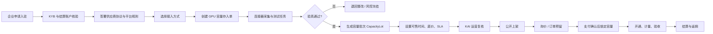
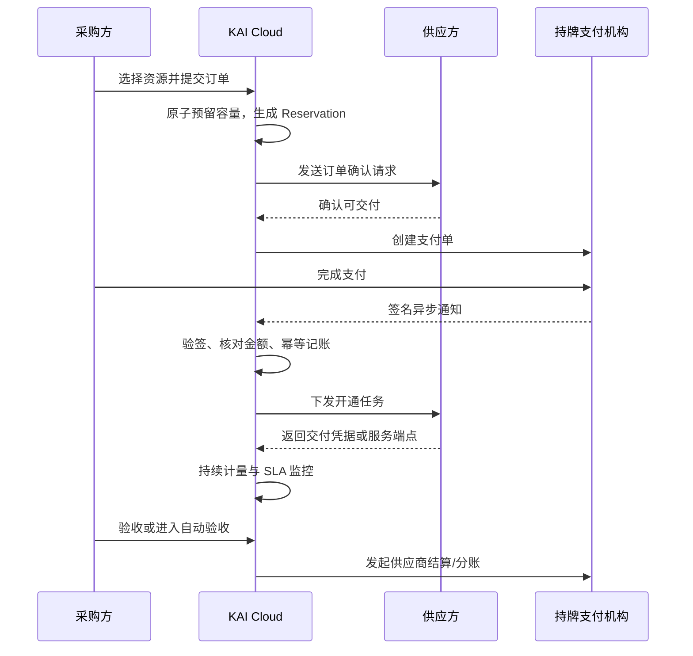

# KAI Cloud 算力容量上架与存取流程方案 v1.0

> 适用范围：cloud.kai.com 核心算力交易平台。首版不包含 35 家零售站，不把 KOD/MOD 作为平台主流程。
>
> 文档目标：让供应商能够把真实 GPU、Token 服务、柜月、NAS 和模型实例容量接入平台，并形成可验证、可上架、可锁定、可交付、可结算、可取出的闭环。

## 1. 先确定一个原则：容量不是平台币

KAI Cloud 可以使用“存入容量 / 取出容量”作为产品语言，但底层含义必须明确：

- **存入容量**：供应商承诺一段未来时间内可交付的服务能力；平台完成验真后，创建一笔 `CapacityLot`（容量批次）并锁定为可售库存。
- **取出容量**：供应商申请释放尚未被报价、订单或交付任务占用的剩余容量；已经锁定的部分不能直接取出。
- **容量账户**：记录服务能力的业务账本，不是资金账户、储值钱包、证券账户或虚拟资产账户。
- **出售算力**：出售的是约定时间、规格和 SLA 下的服务使用权，不默认代表 GPU、服务器或机柜实物所有权转移。

统一可售公式：

```text
可售容量 = 已验真容量 - 报价预留 - 订单锁定 - 交付中容量 - 已消耗容量 - 风控冻结容量
```

任何上架、改价、取出和取消操作都必须经过同一容量账本，禁止前端直接改库存数字。

## 2. 五类容量的可交易定义

| 容量类型 | 最小可交易单元 | 存入时必须写明 | 平台验真方式 | 允许取出的条件 |
|---|---|---|---|---|
| Token 服务容量 | 百万 Token；输入、缓存、输出分开 | 模型、服务商、上下文档位、输入/缓存/输出价、配额周期、并发和地区 | 调用测试、限流头/账单读取、连续健康检查 | 未预留且未消耗的后续配额；已售 Token 不可撤回 |
| 柜月容量 | 机柜月 + kW 月 | 机房、机柜规格、可用功率、PUE/电价口径、网络、冷却、起止月份 | 主体与机房资质核验、现场或视频核验、功率和网络测试 | 仅可释放尚未签约的未来月份；已交付月份不可取出 |
| GPU 容量 | 卡时或服务器时 | GPU 型号/显存/数量、拓扑、CPU/内存/存储、地区、时间窗、交付形态 | 轻量连接器采集硬件签名，运行基准任务和持续心跳 | 未被报价预留或订单锁定的卡时；运行中任务需先完成或迁移 |
| NAS 容量 | TiB 月；性能档位单列 | 可用容量、协议、IOPS、吞吐、冗余、地区、加密、快照、流量费 | 读写压测、容量与配额读取、故障切换/快照抽检 | 无活跃数据和订单；完成迁移、保留期与删除确认后释放 |
| 模型小时容量 | 模型实例时 | 模型及版本、量化、上下文、并发、吞吐、硬件、部署地区和 SLA | 通过 KAI 网关发起推理测试，核对模型指纹、吞吐、首 Token 延迟 | 停止新任务并排空活跃请求后，释放未预留实例时 |

### 2.1 Token 容量的特殊规则

“模型 Token 综合行情”不能作为成交单位。每笔 Token 容量必须绑定具体模型和价格档位；输入、缓存、输出应拆成独立计价行。综合指数只用于观察固定模型篮子的成本变化，不能代替某个模型的成交价。

### 2.2 NAS 容量的特殊规则

NAS 不是只卖“多少 TB”。同一容量在吞吐、IOPS、可用性、冗余、出网费和数据删除承诺上差异很大，因此必须把“容量档位”和“性能档位”一起锁定。

## 3. 供应商把真实 GPU 上架的完整流程



### 第 1 步：企业入驻，不先开放个人供应商

首笔真实交易建议只允许企业供应商。必须收集并核验：

- 企业名称、统一社会信用代码、注册地址、实际经营地址；
- 法定代表人或授权经办人及授权材料；
- 对公结算账户、开票信息；
- 相关业务许可或合作方许可证明；
- GPU/服务器来源、托管合同、云账号归属或可处分服务容量的证明。

平台把供应商状态设为：`待提交 → 审核中 → 已认证 → 受限 → 已暂停 → 已退出`。认证信息至少每六个月复核一次。

### 第 2 步：签署三份规则

1. 《KAI Cloud 平台服务协议》：平台、供应商和采购方分别承担什么责任。
2. 《算力供应商协议》：容量承诺、超卖、SLA、计量、结算、退款和违约。
3. 《资源与数据接入授权》：连接器能读取哪些指标、保存多久、如何解绑。

合同应使用可追溯的电子签名，并保存签署人、签署时间、合同版本和文件摘要。

### 第 3 步：三种资源接入方式

| 接入方式 | 适合阶段 | 能力 | 上架限制 |
|---|---|---|---|
| 人工材料 + 一次性远程测试 | 首笔交易 | 运营人员核对设备、截图、账单并发起测试任务 | 只能“人工确认库存”，上架周期较长 |
| KAI 轻量连接器（推荐） | v1 正式能力 | 读取 GPU/CPU/内存/网络、时间窗和任务状态，上传签名心跳 | 可持续展示“已验证”，支持自动锁定与释放 |
| 云厂商只读 API / 子账号 | 云资源供应商 | 读取实例规格、配额、账单和开关机状态 | 权限必须最小化；不得要求供应商提交主账号密码 |

连接器采用一次性配对码与短期证书，不在网页中保存 SSH 私钥、云主账号密码或机器 root 密码。连接器只上报业务所需指标，不读取客户训练数据、模型文件或 NAS 文件内容。

### 第 4 步：创建 GPU 容量存入单

供应商填写：

- 资源：GPU 型号、显存、卡数、NVLink/拓扑、服务器配置；
- 交付：裸机、虚拟机、容器、API 或任务托管；
- 地区：省市、机房区域，公开页只显示脱敏区域；
- 时间：可售开始时间、结束时间、每天可用时段；
- 数量：总卡时/服务器时、最小起订量、最大并发；
- SLA：可用性、故障响应、替换时限、数据删除时限；
- 价格：供应商底价、目标价、是否含税/电费/网络/存储；
- 证明：设备/云资源归属、最近账单或托管证明。

提交后生成 `DEP-GPU-日期-序号`，状态为 `待验真`，此时不能公开销售。

### 第 5 步：平台验真

验真任务至少包含：

1. 连接器读取 GPU 型号、UUID 摘要、显存、驱动/CUDA 兼容信息；
2. 运行 10–30 分钟标准任务，记录吞吐、显存错误、温度和网络；
3. 对比申报卡数、实际可调度卡数和现有任务占用；
4. 连续心跳达到设定时长；
5. 风控检查同一设备是否被多个供应商重复存入。

通过后生成不可变的验真报告版本，并把设备与 `CapacityLot` 绑定。验真过期、心跳中断或关键配置变化时，自动转为 `待复验`，停止接受新订单。

### 第 6 步：容量入账与公开上架

验真通过后才写入容量账本：

```text
CapacityLot
├─ 所有者：supplier_id
├─ 类型：gpu
├─ 规格指纹：resource_fingerprint
├─ 单位：卡时 / 服务器时
├─ 总量、可售量、已预留量、已交付量
├─ 可售时间窗
├─ SLA 与计价口径版本
└─ 验真报告与最近心跳
```

供应商再创建 `Listing`。公开页只展示脱敏供应商等级、区域、规格、可售时间、SLA 和标准化报价，不公开原始证明、设备 UUID、机房地址或供应商底价。

## 4. 从询价到真实支付与交付



关键规则：

- 订单创建时先做短时预留，避免两名买家买到同一容量；未付款按 TTL 自动释放。
- 不能依据前端“支付完成”页面判断成功。只有持牌支付机构的签名异步通知，经订单号、金额、币种和幂等校验后，才能把订单置为 `已支付`。
- 平台不自建资金池或可提现余额。优先采用持牌支付机构的平台开户、收单、分账/结算能力。
- 交付凭据不通过普通聊天明文发送；使用一次性领取链接、短期凭据或采购方公钥加密。
- 计量记录由供应商连接器与 KAI 侧网关双源比对；差异超过阈值自动暂停结算。

### 一笔 100 元 GPU 订单的计算例

假设合同约定：供应商结算 94 元、KAI 服务费 3 元、单级代理佣金 3 元。流程不是前端直接拆账，而是：

1. 支付机构确认实收 100 元；
2. 平台锁定对应卡时并开通；
3. 订单验收后生成结算指令；
4. 供应商、平台和代理分别形成可核对的结算明细；
5. 如发生退款，先按原订单冲销服务费和佣金，再生成新的结算净额。

比例只是合同配置项，不能写死在前端，也不能在订单未结算时提前发佣。

## 5. 容量取出流程

供应商从“容量账户”选择容量批次并提交取出数量与生效时间。系统依次检查：

1. 供应商仍拥有该容量批次的操作权；
2. 申请数量不超过可售余额；
3. 没有报价预留、未支付订单预留、已支付订单或交付中任务；
4. NAS 已完成数据迁移和删除确认，模型/GPU 已排空任务；
5. 没有投诉、争议、退款或风控冻结；
6. 满足平台规则中的提前通知期。

结果分三种：

- **立即取出**：完全空闲的未来容量，直接下架并释放。
- **部分取出**：只释放未占用余额，已锁定部分继续履约。
- **排期取出**：当前有任务，设置停止接单时间，待任务排空后自动释放。

取出不是删除历史记录。容量批次、订单、计量与结算记录继续保留，只把剩余可售量转为 `已释放`。

## 6. 价格由谁决定

KAI Cloud 不应单方面指定所有成交价。建议采用三层价格：

1. **行情参考价**：由 KAI 汇总同规格、同地区、同口径报价，展示 P25/P50/P75。
2. **供应商要价**：供应商设置底价和目标价，仅平台内部可见底价。
3. **订单执行价**：询价、固定价或竞价完成后，由买卖双方确认。

平台把不同供应商报价标准化为“含税 / 电费 / 网络 / 存储 / SLA”后的有效单价；偏离行情阈值只触发提示和人工复核，不自动篡改供应商价格。

## 7. 单级代理返佣

返佣只做一级，不做多级裂变。必须满足：

- 代理关系在订单创建前已经绑定并留存归因证据；
- 佣金基数、比例、上限和有效期写入订单快照；
- 只有 `已验收 → 已结算` 的订单生成佣金；
- 退款、拒付和赔付按原订单冲销；
- 供应商、代理和平台分别获得对账单及发票/税务处理状态；
- 运营人员不能直接修改已结算佣金，只能用反向分录更正。

## 8. 必须新增的后台模块与数据表

现有 KAI Cloud 已有行情、需求、供应方草稿和报价响应；真实上架还需要以下模块：

| 模块 | 核心对象 |
|---|---|
| 企业与权限 | `organizations`, `organization_members`, `supplier_profiles`, `kyb_checks` |
| 资源接入 | `connectors`, `physical_resources`, `verification_runs`, `heartbeats` |
| 容量账本 | `capacity_lots`, `capacity_ledger_entries`, `capacity_withdrawals` |
| 上架与报价 | `listings`, `listing_terms`, `supplier_quotes`, `normalized_quotes` |
| 订单与锁定 | `orders`, `reservations`, `provisioning_tasks`, `acceptances` |
| 计量与 SLA | `metering_records`, `sla_events`, `usage_reconciliations` |
| 支付与结算 | `payment_orders`, `payment_events`, `refunds`, `settlements` |
| 返佣 | `agent_links`, `commission_rules`, `commission_entries` |
| 风控审计 | `risk_holds`, `disputes`, `audit_logs`, `rule_versions` |

容量账本只允许追加分录，不允许覆盖历史余额。关键写操作必须使用数据库事务、版本号和幂等键；支付通知、连接器心跳和计量上报都要支持重复发送而不重复记账。

## 9. 状态机

### 容量批次

```text
待提交 → 待验真 → 验真中 → 已验真 → 已上架
                              ├→ 部分锁定 → 已售罄
                              ├→ 待复验 → 已上架
                              ├→ 风控冻结
                              └→ 已释放
```

### 订单

```text
询价中 → 待双方确认 → 容量预留 → 待支付 → 已支付
      → 开通中 → 交付中 → 待验收 → 已验收 → 已结算
                          ├→ 争议中
                          ├→ 退款中 → 已退款
                          └→ 取消 → 释放容量
```

## 10. 首笔真实 GPU 交易的上线方案

不要同时开放五类容量。先用一个供应商、一个采购方、一个 GPU 规格、一个地区和一种“卡时”单位跑通。

### 第 1 阶段：人工可控闭环（1–2 周）

- 企业供应商 KYB、对公账户和合同由运营人工复核；
- 供应商提交 GPU 存入单，KAI 远程运行测试任务；
- 运营后台确认容量批次，上架一个固定时间窗；
- 买家下单后人工确认库存，支付走已签约持牌支付机构；
- 支付回调自动更新订单，开通与验收先由运营双人复核；
- 结算与佣金生成系统明细，财务确认后执行。

### 第 2 阶段：连接器与自动锁定（2–4 周）

- 发布 KAI 轻量连接器；
- 自动采集 GPU 心跳、任务状态和可用时间窗；
- 订单预留与容量账本使用原子事务；
- 自动停止超卖资源，支持部分取出。

### 第 3 阶段：扩展容量品类

先增加模型小时和 Token 服务容量，再增加 NAS，最后增加柜月。柜月涉及机房、功率、网络和更长合同周期，运营核验最重，不建议最先自动化。

### 首笔成交 Go / No-Go 清单

- [ ] 平台运营主体、域名和平台规则已公示；
- [ ] 供应商主体、许可、资源归属和对公账户已核验；
- [ ] 已与持牌支付机构完成商户、回调、退款和结算联调；
- [ ] 容量存入、预留、支付、开通、计量、验收、结算、取出状态均有审计日志；
- [ ] 同一容量的并发下单测试不会超卖；
- [ ] 支付回调重复 10 次只生成一次入账；
- [ ] 资源断连会停止新订单，不影响已有订单的应急处理；
- [ ] 退款会释放未使用容量并冲销佣金；
- [ ] 买卖双方可以下载合同、订单、计量和对账单；
- [ ] 客服、争议、数据删除和事故响应负责人已明确。

## 11. 中国境内上线前必须确认的边界

以下是产品和技术方案，不替代专项法律意见：

1. KAI Cloud 提供撮合、信息发布、订单生成或在线支付时，通常会落入网络交易平台经营者的义务范围。平台需要核验、登记平台内经营者，当前规则要求至少每六个月复核，并承担信息公示、规则管理和交易记录保存责任。[《网络交易监督管理办法》](https://www.samr.gov.cn/zw/zfxxgk/fdzdgknr/fgs/art/2025/art_4b47c79b8d994a42bba4835997688faa.html)
2. 商品/服务信息和交易信息自交易完成之日起保存不少于三年，且要保证完整性、保密性和可用性。[《中华人民共和国电子商务法》](https://www.samr.gov.cn/wljys/gzzd/art/2023/art_3e75434c954b4cb9bd14867dacff26d1.html)
3. 2026 年 2 月 1 日起施行的平台规则办法要求平台规则公开、公平、公正，并在首页持续提供可完整阅览和下载的规则入口；收费和争议条款要显著提示。[《网络交易平台规则监督管理办法》](https://www.samr.gov.cn/zw/zfxxgk/fdzdgknr/fgs/art/2026/art_85b474fc5a08494bb60ca6a280b98d7d.html)
4. 不自建无牌支付能力。转移货币资金的支付业务应由银行或持牌非银行支付机构提供，平台使用其收单、分账和结算产品。[《非银行支付机构监督管理条例》](https://www.pbc.gov.cn/tiaofasi/144941/144953/5174993/index.html)
5. 如果 KAI 自己利用数据中心设备和资源对外提供按需云服务，而不只是撮合第三方，可能触及 IDC/互联网资源协作服务许可范围，应在商业模式确定后由电信业务律师和主管部门确认。[工信部门《电信业务分类目录》](https://qhca.miit.gov.cn/zwgk/zcwj/flfg/art/2022/art_0a66ad8c82c94c77bf56d698a1f35d64.html)
6. 平台企业自 2025 年起存在平台内经营者身份和收入等涉税信息报送义务，产品一开始就要保存主体、订单、收入、退款和结算口径。[国家税务总局 2025 年第 15 号公告](https://fgk.chinatax.gov.cn/zcfgk/c100012/c5241477/content.html)
7. KYB 经办人、代理人和个人供应商信息按最小必要原则处理，区分合同履行、法定义务与同意等不同处理依据。[《中华人民共和国个人信息保护法》](https://www.npc.gov.cn/WZWSREL25wYy9jMi9jMzA4MzQvMjAyMTA4L3QyMDIxMDgyMF8zMTMwODguaHRtbD9yZWY9aW1i)
8. 电子合同应保存可调取的数据电文、签署主体、发送接收时间及完整性证据。[《中华人民共和国电子签名法》](https://dcj.mofcom.gov.cn/article/bi/200409/20040900275540.shtml)

## 12. 对 cloud.kai.com 的直接改造顺序

1. 把当前“供应方资源草稿”升级为“企业认证 → 资源接入 → 容量存入单”。
2. 新增“容量账户”，分别显示可售、预留、交付中、已消耗、冻结、可取出。
3. 新增资源验真后台和连接器配对，不通过验真的资源不能公开上架。
4. 新增订单与容量预留，先解决并发超卖，再接支付。
5. 接入持牌支付机构的真实回调、退款和结算；前端不得伪造支付成功。
6. 新增计量、验收、争议、结算和单级返佣。
7. GPU 跑通首笔后，再按模型小时 → Token → NAS → 柜月的顺序扩展。

这条路线保留 cloud.kai.com 的行情与价格发现能力，但平台的核心会从“发布需求和报价”升级为“经过验真的容量账本 + 订单交付与结算”。
