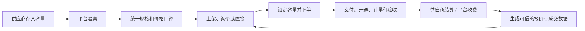
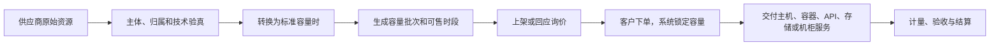
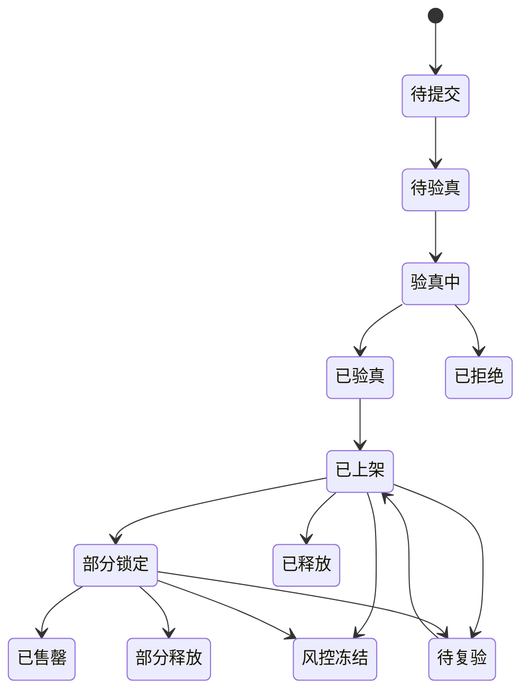
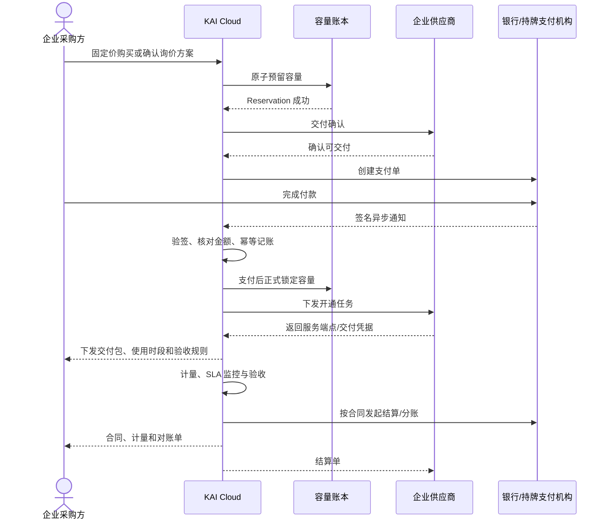
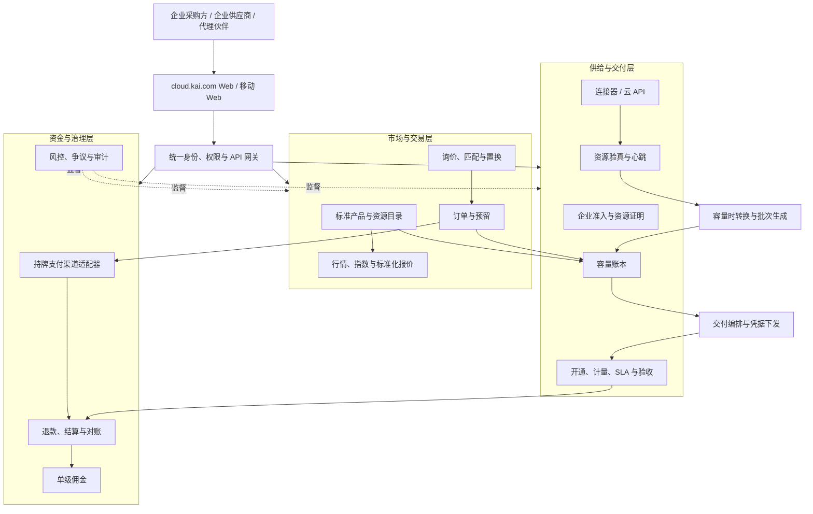

# KAI Cloud 算力交易所白皮书

## 让分散的算力，成为可上架、可购买、可交付的企业服务

**版本：** v1.1 算容转换增补版

**发布日期：** 2026 年 8 月

**发布方：** KAI Cloud / 中国 Token 学院算力市场

**适用平台：** cloud.kai.com

---

## 30 秒看懂 KAI Cloud

> **KAI Cloud 不是自己建机房卖算力，也不是只展示行情。它把不同供应商的 GPU、模型、Token、NAS 和机柜容量，变成企业能比较、能下单、能验收的服务。**

| 一个问题 | 一句话回答 |
|---|---|
| 谁会来买？ | 需要 GPU、模型调用、存储或机柜容量的企业 |
| 谁会来卖？ | 云厂商、智算中心、数据中心、模型服务商及拥有可售容量的企业 |
| 平台解决什么？ | 资源真不真、价格怎么比、付款后能否交付 |
| 平台怎么赚钱？ | 交易完成后收服务费，并向企业提供采购、验真、计量和数据服务 |
| 为什么客户不直接私下交易？ | 平台把比价、锁库存、支付、交付、计量、验收和争议证据连在一起 |
| 五类资源怎么统一？ | 先分别转成 GPU 小时、Token 容量时、柜时、NAS 容量时和模型服务时，再按当时基准价比较价值 |
| 供应商的 GPU 怎么给到客户？ | 验真后生成可售时段，客户下单后锁定容量，供应商交付云主机、容器、裸机或 API 端点，平台持续计量和验收 |
| 第一步做什么？ | 先跑通一个城市、一种 GPU、一家供应商和一家采购方的真实订单 |

**一句话记住：** 行情不是 KAI Cloud 的起点，真实交易才是；行情是真实报价、询价和成交累积出来的结果。

### 怎么读这份白皮书

- 决策者、投资人和合作伙伴：先看第一至第三章；
- 采购方和供应商：重点看第三、第六至第十二章；
- 产品和技术团队：重点看第七至第十四章；
- 法务和财务：重点看第五、第十一、第十五章。

---

## 第一章　商业逻辑：这门生意为什么能成立

### 1.1 卖的不是“算力概念”，而是可验收的服务

供应商手里有 GPU、模型调用额度、存储和机柜；需求方有训练、推理、数据存储和业务上线需求。两边并不缺资源和需求，缺的是一套能让订单真正完成的共同规则。

KAI Cloud 把一笔模糊的“我有算力”变成六个可确认的问题：

1. 卖的究竟是什么规格？
2. 在哪里、什么时间可用？
3. 有多少容量真的可以卖？
4. 总成本包含哪些费用？
5. 付款后怎么开通、计量和验收？
6. 交付失败时由谁退款、赔付和留证？

这六个问题回答清楚，算力才从“线索”变成“商品化服务”。

### 1.2 平台同时为三方创造价值

| 角色 | 原来怎么做 | 使用 KAI Cloud 之后 |
|---|---|---|
| 采购方 | 到处问价，用表格比较，付款后再追交付 | 在统一口径下比价，按订单验收和对账 |
| 供应商 | 靠熟人和销售找客户，闲置容量难以变现 | 存入经过验真的容量，获取需求并按交付结算 |
| KAI Cloud | 不必先重资产建设大规模机房 | 通过标准、验真、交易和交付系统收取服务费 |

### 1.3 完整闭环



这个闭环里，**价格发现不是一项独立的内容业务**。它来自真实供给、真实询价和真实交易，又反过来降低下一笔交易的决策成本。

### 1.4 什么会随着真实交易不断累积

更多真实供给进入，采购方更容易找到匹配资源；更多订单完成，平台就有更可信的价格、交付和 SLA 数据；数据越可信，下一家企业的决策和交付风险就越低。

真正会累积的不是注册数，而是四样东西：经过验真的供给、可执行的价格、可复用的交付流程和可查证的履约记录。

### 1.5 冷启动不追求“什么都有”

平台不应先收集大量无法交付的资源卡片，而应从一条最窄的成交路径开始：

```text
一个城市 + 一种 GPU + 一个计价单位
+ 一家可验真供应商 + 一家明确采购方
= 第一笔可验收、可对账、可复制的真实交易
```

---

## 第二章　商业模式：KAI Cloud 如何赚钱

### 2.1 先赚交易完成后的钱

KAI Cloud 的核心收入应与客户获得真实结果绑定：供应商完成交付、采购方完成验收，平台才确认主要服务收入。

| 收入来源 | 谁付费 | 什么时候收 | 客户买到什么 | 优先级 |
|---|---|---|---|---|
| 成交技术服务费 | 供应方或按合同分担 | 订单验收并进入结算后 | 获客、锁容量、订单、支付、交付和对账闭环 | 核心 |
| 企业采购服务 | 采购方 | 大额询价或项目交付按合同节点 | 需求梳理、供应商筛选、比价和项目协调 | 核心 |
| 供应商系统与验真服务 | 供应方 | 按次、按容量或按年 | 资源验真、连接器、库存和报价工作台 | 第二阶段 |
| 交付、计量与服务等级管理 | 买卖双方按合同分担 | 随订单或按月 | 统一开通、用量记录、故障证据和验收 | 第二阶段 |
| 行情与数据服务 | 企业采购、供应商和研究机构 | 数据样本达到可发布标准后订阅 | 历史价格、采购基准、API 和交付质量洞察 | 中后期 |

### 2.2 一笔 100 元订单，钱怎么流转

假设客户实付 100 元，合同约定供应商 94 元、KAI Cloud 3 元、直接代理佣金 3 元：

```text
客户支付 100 元
        ↓
持牌支付机构确认收款
        ↓
供应商开通算力 → 客户使用 → 平台计量 → 客户验收
        ↓
供应商结算 94 元 + 平台服务费 3 元 + 直接代理佣金 3 元
```

这只是一个便于理解的分账示例，不是已生效价格。真实比例、税费、通道费、发票和结算周期必须由合同和支付产品确定。没有代理的订单不会凭空产生佣金。

### 2.3 平台经营的不是交易额，而是每笔交易的质量

```text
已完成交易额
= 已验收的服务数量 × 订单执行价

平台净收入
= 已确认服务收入
- 支付通道、代理佣金、验真、交付与客服成本
- 退款、赔付和冲正
```

平台首先要证明三件事：能让供应商多卖出可交付容量，能让采购方更快拿到合适资源，能把退款、赔付、欺诈和人工交付成本控制在收入之内。

### 2.4 获客方式

第一阶段不走海量 C 端流量，而是围绕已知企业需求做双边冷启动：

1. 先找到有确定规格、预算和交付时间的锚定采购方；
2. 只引入能回应该需求的少量供应商；
3. 用人工验真和项目经理保证前 10 笔交付；
4. 把重复出现的验真、报价、开通和对账步骤产品化；
5. 在真实数据足够后，再对外发布行情与开放更多品类。

### 2.5 平台不靠什么赚钱

- 不靠客户充值后长期沉淀的资金；
- 不靠承诺算力容量会升值；
- 不靠虚构成交和 K 线吸引投机；
- 不靠多层级代理和发展人头；
- 不通过不透明价差同时扮演平台、交易对手和价格裁判者。

---

## 第三章　算容转换与交付：供应商的资源怎么给到客户

### 3.1 平台不是把设备“搬给”客户

供应商的 GPU、模型、Token 配额、NAS 和机柜仍然由供应商运行。KAI Cloud 所做的，是把这些原始资源变成一份可下单的**标准容量合约**，再把合约约定的服务交付给客户。

一份标准容量合约必须说清楚：

```text
什么资源 + 多少容量 + 哪个时间段
+ 什么地区 + 什么性能 + 什么价格
+ 怎么开通 + 怎么计量 + 怎么验收
```



**客户最终得到的不是一个抽象数字，而是可登录、可调用、可挂载或可入场使用的真实服务。**

### 3.2 五类资源怎么转成“容量时”

| 原始资源 | 平台标准单位 | 存入数量怎么算 | 客户最终得到什么 |
|---|---|---|---|
| GPU | **GPU 小时（卡时）** | 经验证的 GPU 卡数 × 可交付小时，必须绑定型号、显存、拓扑、地区和时间段 | 云主机、虚拟机、容器、Kubernetes 环境或裸机账号 |
| Token 服务 | **Token 容量时** | 某具体模型每小时承诺的百万 Token 吞吐 × 保留小时；按实际用量采购时则直接按百万 Token 计量 | 受限额保护的 API Key、平台网关端点和输入/缓存/输出用量账单 |
| 机柜容量 | **柜时 / kW 容量时** | 经验证的机柜位数 × 保留小时，同时绑定功率、网络、冷却和地址；对外可按柜月销售 | 机位、约定功率、网络、入场授权和工单服务 |
| NAS 存储 | **NAS 容量时（TiB·时）** | 可用 TiB × 保留小时，必须绑定协议、IOPS、吞吐、冗余、流量费和数据区域 | 存储端点、挂载凭据、容量配额、快照和性能档位 |
| 模型服务 | **模型服务小时（实例时）** | 经验证的模型实例数 × 可服务小时，必须绑定模型版本、上下文、并发、吞吐和响应时间 | 独享或预留的模型实例、API 端点和性能承诺 |

“柜月小时”不建议作为一个混合单位。平台内部使用“柜时”和“kW 容量时”计量，客户端仍可按“柜月”买卖。为了行情比较，可用 720 小时作为标准月换算基准；真实结算仍按合同月的实际时间和条款。NAS 月和模型实例月同理。

### 3.3 “都可以转化”分为两层

#### 第一层：同类资源转成可交付的容量时

同类资源可以在单位之间换算：

```text
8 张 H100 × 10 小时 = 80 H100 GPU 小时
10 百万 Token/小时 × 5 小时 = 50 百万 Token 容量时
2 个机柜 × 720 小时 = 1,440 柜时
20 TiB NAS × 100 小时 = 2,000 TiB·时
3 个模型实例 × 24 小时 = 72 模型服务小时
```

这是真实的技术容量换算。但 H100 和 A800、不同模型的 Token、不同 IOPS 的 NAS，不能只因为都使用“小时”就被视为同一种商品。

#### 第二层：跨品类转成标准算容价值

GPU 小时不能在物理上变成 NAS 容量时，但可以按同一时点的标准化参考价计算价值，用于报价比较、组合采购和双边置换：

```text
标准算容价值
= 具体标准产品的容量数量
× 转换时点的标准化参考单价

置换补差
= 我可提供的标准算容价值
- 我需要的标准算容价值
```

例如：

```text
甲方提供 100 H100 GPU 小时 × 20 元/小时 = 2,000 元标准算容价值
乙方提供 10 百万 Token/小时 × 5 小时 × 30 元/百万 Token = 1,500 元标准算容价值
双方可调整 Token 容量、调整 GPU 小时，或由其中一方补差 500 元
```

标准算容价值是当次报价或置换的**计算尺度**，不是代币、不是可充值余额、不承诺升值，也不能脱离具体订单自由转账。订单确认时必须固化价格时点、价格来源、实际交付单位和补差金额。

### 3.4 一家 GPU 供应商怎么把算力给到客户

假设供应商在上海有 8 张 H100 80GB，未来 7 天连续可用。供应商必须提交精确到 UTC 的连续时间窗；夜间 20:00 至次日 08:00 这类间歇容量不能包装成连续 25 小时商品：

```text
理论容量 = 8 张 × 24 小时 × 7 天 = 1,344 H100 GPU 小时
可售容量 = 1,344 - 144 维护保留 - 200 已占用 = 1,000 H100 GPU 小时
```

1. **连接资源**：供应商安装 KAI 轻量连接器，或提供云厂商只读 API；首笔交易也可人工核验。
2. **验证真实性**：平台核对型号、卡数、显存、设备指纹、拓扑、驱动、温度和基准测试。
3. **声明可售时段**：供应商不能只填“有 8 张卡”，而要填写每天哪些时间能够交付。
4. **生成容量批次**：系统生成“上海 H100 80GB / 600 GPU 小时 / 指定时间窗口”容量批次。
5. **上架或报价**：供应商选择固定价上架，或用该容量批次回应客户询价。
6. **客户下单**：客户购买 100 GPU 小时，例如“4 张 H100 连续使用 25 小时”。
7. **容量锁定**：平台先验证“4 张并行卡在完整 25 小时时间窗内均可用”，再把 100 GPU 小时从“可售”改成“订单锁定”，剩余可售变为 900。
8. **交付环境**：供应商按订单创建虚拟机、容器、Kubernetes 命名空间或裸机账号，平台向客户安全交付登录地址和短期凭据。
9. **客户开始使用**：客户登录后能够看到 4 张 H100、可用时间、网络、存储和服务等级。
10. **双边计量**：供应商连接器和 KAI 计量系统同时记录开始、停止、卡数、故障和替换。
11. **验收与结算**：客户确认交付或符合自动验收条件后，订单结算，平台生成供应商应付和服务费。
12. **释放剩余容量**：未成交的 900 GPU 小时可继续销售；已履约的 100 GPU 小时进入已消耗记录。

这样，“供应商有 8 张 GPU”才真正变成“客户可在约定时间内登录并使用 4 张 H100 25 小时”。

### 3.5 不同容量的交付出口

| 订单类型 | 客户端看到的交付物 | 平台核心验收项 |
|---|---|---|
| GPU 小时 | 主机/容器地址、账号、GPU 数量、开始结束时间 | 型号、卡数、在线时长、作业可运行性 |
| Token 容量时 | API 端点、Key、模型名、吞吐上限和用量看板 | 具体模型、限额、输入/输出用量、错误率和延迟 |
| 柜时/柜月 | 机位确认、功率、网络、入场授权和工单入口 | 上电、网络、功率和服务可用性 |
| NAS 容量时 | 存储端点、挂载方式、凭据、配额和快照策略 | 可用容量、IOPS、吞吐、冗余和删除确认 |
| 模型服务小时 | 专属 API/网关端点、实例状态、并发和性能看板 | 模型版本、在线时长、吞吐、首 Token 延迟和错误率 |

### 3.6 第一笔 GPU 交易操作清单

| 步骤 | 谁来做 | 发生什么 | 留下什么证据 |
|---|---|---|---|
| 1. 入驻 | 供应商 | 提交企业、资源归属、对公账户和开票资料 | 主体与授权记录 |
| 2. 存入 | 供应商 | 申报 GPU 型号、卡数、地区、时间和可售卡时 | 容量存入单 |
| 3. 验真 | KAI 运营 | 核对资源证明，运行标准测试 | 验真报告与有效期 |
| 4. 上架 | 供应商 | 确认价格、最小起订量、服务等级（SLA）和交付方式 | 有版本的上架条款 |
| 5. 选购 | 采购方 | 筛选资源，直接购买或发起询价 | 需求单或报价确认 |
| 6. 锁定 | 平台 | 系统一次性锁定容量，防止同一容量被再卖 | 容量锁定记录 |
| 7. 支付 | 采购方 | 通过持牌支付机构完成付款 | 服务端签名通知和支付流水 |
| 8. 交付 | 供应商 | 开通环境、服务端点或交付凭据 | 开通任务和凭据领取记录 |
| 9. 计量 | 双方系统 | 记录卡时、性能、故障和服务达标情况 | 平台与供应商两边的用量记录 |
| 10. 验收 | 采购方 | 按订单规则确认服务完成 | 验收记录 |
| 11. 结算 | 平台与支付机构 | 生成供应商应付、平台服务费和佣金 | 结算与发票记录 |
| 12. 复盘 | KAI 运营 | 检查利润、时效、差错、退款与客户反馈 | 订单复盘报告 |

前 10 笔交易的目标不是做大交易额，而是把这 12 步变成同一套可重复执行的流程。任何一步只能靠某个人的聊天记录或临时经验完成，都说明交易平台还没有真正跑通。

---

## 第四章　为什么需要算力服务交易平台

### 4.1 供给存在，但市场语言不统一

同一类 GPU 资源可能按卡时、服务器时、整机月、任务包或预留容量报价；有的报价含税、电费和网络，有的只包含裸资源；模型服务又分别按输入 Token、缓存 Token、输出 Token、实例小时或吞吐容量计价。价格看似都以人民币表示，但实际购买的服务边界不同。

如果没有统一产品定义，市场只能展示价格，无法形成可执行交易。

### 4.2 报价存在，但库存真实性不足

传统撮合依赖表格、聊天和人工确认。相同设备可能被多次发布，资源状态更新滞后，成交时才发现已经占用。真实交易需要知道的不只是“供应商说有 1000 卡时”，而是这 1000 卡时对应哪些设备、什么时间可用、多少已经预留、心跳是否正常，以及是否能按约定方式交付。

### 4.3 成交存在，但支付和交付割裂

算力不是付款后立即完成交割的普通数字商品。订单可能经历配置确认、容量预留、环境开通、测试验收、持续计量、故障替换和数据删除。付款成功页面不能证明资源已经交付，连接器显示在线也不能证明合同已经履行。

因此，算力交易必须同时维护两本可勾稽的账：

- **资金与结算记录**：实付、退款、供应商应付、平台服务费、佣金和通道费；
- **容量账本**：存入、可售、预留、锁定、交付、消耗、冻结和释放。

### 4.4 政策方向正在从建设算力转向互联、调度与统一服务

国家发展改革委等部门提出完善算力服务平台和数据采集机制，强化市场供需对接，促进算力供给、调度、使用及结算智能化，并探索统一度量、统一计费、统一交易、统一结算的算网协同运营机制。[《关于深入实施“东数西算”工程加快构建全国一体化算力网的实施意见》](https://www.ndrc.gov.cn/xxgk/zcfb/tz/202312/t20231229_1363000.html)

工业和信息化部 2025 年发布的算力互联互通行动计划提出：到 2026 年建立较为完备的标准、标识和规则体系，到 2028 年基本实现全国公共算力标准化互联，推动算、存、网多种业务跨主体、跨架构、跨地域互通。[《算力互联互通行动计划》](https://fjca.miit.gov.cn/zwgk/zcwj/wjfb/art/2025/art_25eea57dd6f840e680184fffb086883d.html)

KAI Cloud 的产品方向与这一变化一致：不重复建设底层算力，而是让不同主体的算力可以被标准化发现、验证、交易、调度和结算。

---

## 第五章　平台定位与边界

> **名称边界：** 本白皮书所称“算力交易所”，业务实质是面向 GPU、模型 Token、模型实例、存储和数据中心容量的算力服务交易平台，不是依法设立的证券或期货交易所。本文是业务、产品与技术设计文件，不替代法律、税务、审计、电信许可或支付机构的专项意见。

### 5.1 一句话定义

> KAI Cloud 是连接算力需求方、供应方和服务伙伴的企业级交易基础设施，让每一单位算力都能说明是什么、在哪里、何时可用、如何计价、由谁交付。

### 5.2 平台承担的职责

- 建立标准资源目录、计价单位与报价口径；
- 汇集并标准化供应商报价，生成可解释的市场行情；
- 核验供应商主体、资源归属、规格和可用状态；
- 维护容量账本，防止重复挂牌和超卖；
- 支持固定价、询价、容量预留和双边置换；
- 对接持牌支付机构，管理订单、退款、结算和对账状态；
- 记录交付、计量、SLA、验收和争议证据；
- 支持单层代理归因与结算后返佣；
- 为买卖双方提供合同、订单、计量和对账材料。

### 5.3 平台不承担的职责

- 不把算力容量发行成货币、证券或承诺收益的金融资产；
- 不开设可充值、自由转账、兑现金的平台资金钱包；
- 不提供杠杆、保证金、期货、永续合约或做市承诺；
- 不使用报价或补点数据冒充真实成交；
- 不允许未经验证的资源直接成为“可立即购买”库存；
- 不允许供应商因取出容量而逃避已成交订单的履约义务；
- 不在第一阶段开放多层级返佣、个人资源自由转售或二级市场。

### 5.4 主要参与方

| 参与方 | 核心诉求 | 平台提供 |
|---|---|---|
| 企业采购方 | 找到合适、真实、可交付的算力 | 行情、筛选、询价、订单、交付与对账 |
| 企业供应商 | 把闲置或计划容量变成收入 | 企业入驻、资源验真、容量上架、需求匹配、结算 |
| 云厂商/智算中心 | 扩大渠道并降低销售摩擦 | 标准产品接入、API/连接器、批量报价、交付协同 |
| 模型服务商 | 销售具体模型的调用或实例容量 | 分模型价格档位、调用计量、网关与 SLA |
| 数据中心/NAS 供应商 | 销售机柜、功率、网络和存储容量 | 长周期容量批次、性能档位、合同与验收 |
| KAI 运营 | 管理市场质量和交易风险 | 审核、验真、异常监控、规则版本与审计 |
| 单级代理伙伴 | 推荐真实企业需求 | 订单前归因、结算后佣金、退款冲正与对账 |

---

## 第六章　交易标的与标准产品

### 6.1 三层对象模型

KAI Cloud 不直接交易一句模糊的“算力”，而是使用三层对象：

1. **标准产品 `CapacityProduct`**：可比较的产品定义，例如“H100 80GB 单卡小时”或“某模型 100 万输出 Token”。
2. **容量批次 `CapacityLot`**：某供应商在特定地区和时间窗口内经过验真的可交付数量。
3. **上架单 `Listing`**：容量批次面向市场的价格、最小起订量、有效期、SLA 和成交方式。

标准产品回答“买的是什么”；容量批次回答“谁在什么时间能够交付多少”；上架单回答“以什么条件出售”。

### 6.2 五类首发容量

| 类型 | 主要计价单位 | 必须绑定的交易维度 | 核心验真依据 |
|---|---|---|---|
| GPU 容量 | GPU 小时（卡时）、服务器时 | 型号、显存、卡数、拓扑、地区、时间窗、交付形态 | 硬件指纹、测试任务、持续心跳 |
| Token 容量（模型调用服务） | Token 容量时、百万 Token 实际用量 | 具体模型、服务档位、上下文、输入/缓存/输出、每小时保证吞吐 | 调用测试、配额/账单、限流与健康状态 |
| 模型小时容量 | 模型服务小时、预留容量时 | 模型版本、量化、上下文、并发、吞吐、硬件 | 模型指纹、吞吐、首 Token 延迟、网关健康 |
| 机柜容量 | 柜时、kW 容量时、柜月 | 机房区域、功率、冷却、网络、起止时间、PUE/电价口径 | 主体与许可、现场核验、功率和网络测试 |
| NAS 容量 | TiB·时、TiB 月 | 协议、可用容量、IOPS、吞吐、冗余、流量费、数据安全 | 容量读取、读写压测、快照与故障切换抽检 |

### 6.3 Token 容量时与 Token 实际用量不能混为一谈

Token 容量时购买的是某个时间段内被保证的模型吞吐或限额；百万 Token 购买的是已经实际调用的用量。前者适合需要稳定并发和吞吐的业务，后者适合按调用量结算的业务。两者可以在同一具体模型和同一服务档位下换算，但不能混在一条价格里。

不同模型、上下文、输入/缓存/输出的价格也不同。“模型 Token 综合行情”只能是固定模型篮子的成本指数，用来表示一组主流模型价格的相对变化，不能作为某一模型的统一 Token 成交价。

每笔 Token 订单必须指向具体的：

```text
模型 + 服务商 + 上下文档位 + 价格类型 + 服务区域 + 有效期
```

### 6.4 产品标准字段

每个标准产品至少包含：

```text
product_id
资源类别与技术规格
标准计价单位
地区与网络边界
时间窗口与最小起订量
性能档位与容量上限
SLA、故障响应和替换规则
税费、电费、网络、存储和流量口径
交付形态与验收方法
数据保留、迁移和删除规则
允许的交易方式
```

产品标准由平台规则委员会维护版本。订单创建时固化标准版本，后续修改不能影响已经成交的合同。

---

## 第七章　容量存入、取出与账本

### 7.1 存入和取出的定义

- **存入容量**：供应商把经过验真的未来服务能力纳入平台容量账本，并承诺按照上架条件履约。
- **取出容量**：释放未被报价、订单、置换或交付任务占用的剩余容量。
- **容量账户**：展示业务容量状态，不是资金账户或可兑现金钱包。

供应商存入的不是一笔笼统“算容余额”，而是带有品类、规格、地区和时间窗口的容量批次。GPU 小时、Token 容量时、柜时、NAS 容量时和模型服务小时分别记账；只有在报价或置换发生时，系统才生成当次标准算容价值快照。

统一计算规则：

```text
可售容量
= 已验真存入
- 报价预留
- 订单锁定
- 交付中
- 已消耗
- 风控冻结
```

### 7.2 容量账本采用追加分录

容量余额不能直接覆盖。每一次存入、预留、锁定、消耗、释放和冲正都形成不可变分录：

```text
CapacityLedgerEntry
├─ entry_id / event_id
├─ capacity_lot_id
├─ entry_type
├─ quantity / capacity_unit
├─ product_version / delivery_window
├─ related_quote_id / order_id / swap_id
├─ conversion_snapshot_id（仅跨品类比较或置换使用）
├─ balance_before / balance_after
├─ actor / reason
└─ occurred_at / recorded_at
```

关键写操作使用数据库事务、版本号和幂等键。任何订单只有在容量账本成功完成原子预留后，才能进入待支付状态。

### 7.3 容量状态机



### 7.4 取出规则

供应商申请取出后，系统检查：

- 申请人是否具有容量批次操作权；
- 申请数量是否小于等于可售余额；
- 是否存在报价预留、订单锁定、交付任务、退款或争议；
- GPU/模型任务是否排空，NAS 数据是否完成迁移与删除确认；
- 是否满足提前通知期和合同约定；
- 是否存在风控或司法冻结。

结果可以是立即取出、部分取出或排期取出。取出只改变未来可售余额，不删除历史批次、订单、计量和结算记录。

---

## 第八章　供应商准入与资源验真

### 8.1 企业优先

首阶段仅开放企业供应商。平台核验企业主体、授权经办人、对公账户、开票资料、相关许可和资源归属证明。供应商状态为：

```text
待提交 → 审核中 → 已认证 → 受限 → 已暂停 → 已退出
```

认证信息按适用规则至少每六个月复核，资源证明、许可或结算账户发生变化时触发即时复核。

### 8.2 三种接入模式

| 模式 | 使用场景 | 能力 | 交易限制 |
|---|---|---|---|
| 人工材料 + 远程测试 | 首笔交易、小供应商 | 人工核对资源证明并运行测试任务 | 库存由运营确认，不能声称实时 |
| KAI 轻量连接器 | 自有 GPU、服务器、NAS | 上报规格、可用状态、任务和签名心跳 | 支持持续验真、自动锁定与释放 |
| 云厂商只读 API/子账号 | 云资源和模型配额 | 读取规格、配额、账单和运行状态 | 权限最小化，不接收主账号密码 |

连接器使用一次性配对码和短期证书，不要求上传 SSH 私钥、云主账号密码或 root 密码；只采集验真、库存、计量和 SLA 所需数据，不读取客户模型、训练数据或 NAS 文件内容。

### 8.3 GPU 验真

GPU 存入单至少经过：

1. 资源归属、托管或云账号证明核对；
2. 型号、UUID 摘要、显存、驱动与拓扑采集；
3. 标准基准任务与显存错误检查；
4. 网络、存储和温度等交付条件检查；
5. 连续心跳观察；
6. 重复存入、跨平台重复承诺和异常占用检查。

关键规格变化、心跳中断或验真到期时，容量转为 `待复验` 并停止接受新订单。

### 8.4 公开信息与保密信息分离

公开页展示供应商等级、脱敏区域、产品规格、可售时间、SLA 和标准化价格。设备 UUID、机房详细地址、资源证明、供应商底价、内部风控备注和原始报价不得公开给其他供应商或无关采购方。

---

## 第九章　行情与价格发现

### 9.1 三层价格

1. **市场参考价**：相同标准产品、地区和口径的报价与成交统计。
2. **供应商要价**：供应商的底价、目标价和有效期；底价不公开。
3. **订单执行价**：买卖双方通过固定价、询价或协商确认的最终价格。

平台不替供应商决定所有价格，也不允许运营人员无记录地修改价格。异常偏离只触发提示、限流或人工复核。

### 9.2 标准化有效单价

为了比较不同报价，平台计算标准化有效单价：

```text
标准化总成本
= 资源价
+ 税费调整
+ 电费
+ 网络与流量
+ 必选存储
+ 开通及最低消费摊销
+ 可量化 SLA 风险调整

标准化有效单价
= 标准化总成本 / 可交付标准单位
```

每个调整项都必须可见、可解释、可回溯到原始报价；平台不能把估算值伪装成供应商承诺。

### 9.3 P25、P50、P75

- P25：四分之一的有效样本不高于该值，通常伴随更高起订量、较窄时间窗或更严格条件；
- P50：市场有效样本中位数；
- P75：四分之三的有效样本不高于该值，通常包含更灵活交付或更完整服务。

行情页面同时展示样本量、覆盖地区、计价口径、更新时间和有效期。样本不足时不发布百分位结论。

### 9.4 指数与 K 线

- 综合指数只跟踪固定产品篮子的成本变化，不代表统一成交价；
- 价格 K 线只使用相同标准产品的真实成交；
- 没有成交的周期显示无成交，不用报价或人工数据补线；
- 报价曲线、询价中位数和成交 K 线分别标识；
- 撤销、退款或异常交易按公开方法处理，不能事后选择性删除。

### 9.5 数据来源优先级

```text
新鲜、有效、同口径的真实成交
    ↓ 样本不足
可执行供应商报价
    ↓ 样本不足
云厂商/模型厂商官方公开价格
    ↓ 仍不足
带负责人、原因、有效期的人工基准
```

---

## 第十章　交易机制

### 10.1 固定价购买

适合规格标准、库存新鲜、交付自动化程度高的资源。买家确认数量和时间，平台原子预留容量，生成待支付订单。

### 10.2 RFQ 询价

适合大额 GPU 集群、柜月、复杂 NAS 和定制模型服务。需求方发布脱敏需求，匹配供应商提交原始报价，KAI 标准化后向需求方展示。供应商之间不互相查看原始报价。

### 10.3 预留容量

需求方预订未来时间窗口。预留费、取消规则、可变数量和交付前复验写入合同。首阶段只做服务预订，不设计可自由转让的远期或期货合约。

### 10.4 双边置换

置换使用“我可提供 / 我需要”模型：

- 双方容量都必须验真并进入账本；
- 平台先把两边资源分别换算成各自真实容量时，再按同一时点的标准化参考价生成标准算容价值快照；
- 快照展示原始单位、数量、价格来源、时间、标准算容价值和建议补差，双方可以复核；
- 双方确认后原子锁定两边容量；
- 可通过持牌支付渠道补差；
- 任一侧锁定、支付或交付失败时，按规则整体回滚或进入争议处理。

置换完成后，甲方仍然收到具体的 GPU、Token、NAS、模型实例或机柜服务，乙方也收到其订单约定的具体服务；“标准算容价值”只负责比较和计算补差，不代替实际交付。置换仍需订单、合同、计量、税务和结算记录。

### 10.5 首阶段不开放的机制

- 匿名竞价与自动做市；
- 杠杆、保证金和强制平仓；
- 容量份额拆分后自由转让；
- 个人持有权益的现金回购；
- 跨币种自动套利；
- 与算力无真实交付关系的价格合约。

---

## 第十一章　订单、支付、交付与结算

### 11.1 一笔交易的完整链路



### 11.2 支付成功的唯一可信来源

前端支付完成页面不改变订单最终状态。平台只接受银行或持牌支付机构的服务端签名通知，并核对：

- 平台订单号和支付机构流水号；
- 商户、金额、币种和收款状态；
- 通知签名与证书有效性；
- 幂等键和已处理事件；
- 退款、撤销和拒付状态。

平台不自建资金池。资金转移、收单、分账与结算使用银行或持牌非银行支付机构的正式产品。[《非银行支付机构监督管理条例》](https://www.pbc.gov.cn/tiaofasi/144941/144953/5174993/index.html)

### 11.3 订单状态机

```text
询价中 / 待确认
→ 容量预留
→ 待支付
→ 已支付
→ 开通中
→ 交付中
→ 待验收
→ 已验收
→ 已结算
```

异常分支包括：预留过期、支付失败、取消、交付失败、争议中、退款中、已退款和风控冻结。每个异常状态都要说明容量如何释放、资金如何处理、佣金是否冲销及由谁继续操作。

### 11.4 计量与验收

计量采用供应商侧连接器与 KAI 侧网关/探针双源比对。记录至少包含资源、订单、开始结束时间、使用量、性能、错误、采集方、签名和原始证据摘要。

验收规则随产品固化：

- GPU：可用卡数、运行时长、显存/错误、作业结果或环境可用性；
- Token：模型、输入/缓存/输出用量、错误率和延迟；
- 模型小时：实例在线时长、并发、吞吐与模型版本；
- NAS：可用容量、性能、快照、数据迁移与删除确认；
- 柜月：机位、功率、网络、开通时间与服务可用性。

计量差异超过阈值时暂停自动结算并进入人工复核。

### 11.5 一笔 100 元订单的账务处理

假设订单实付 CNY 100.00，合同约定供应商 94 元、平台服务费 3 元、直接代理佣金 3 元：

1. 支付机构确认实收 100 元；
2. 容量账本正式锁定对应服务单位；
3. 供应商完成交付，采购方验收；
4. 系统生成供应商应付、平台服务费和佣金分录；
5. 财务或支付机构按合同执行结算；
6. 如果退款，按原订单冲销服务费和佣金，再释放未使用容量。

比例仅是计算例。真实比例、税费和结算周期按合同和支付产品配置，不写死在页面或代码中。

---

## 第十二章　代理合作与返佣

KAI Cloud 只支持单层直接代理：代理推荐的企业在归因有效期内创建并完成订单，代理可获得该订单佣金；不从被推荐人再次发展的下级订单中分成。

佣金规则：

- 代理主体、协议、收款和税务资料审核通过；
- 归因在订单创建前完成，订单快照固化代理、规则版本和比例；
- 支付成功不等于佣金可结算；订单验收并进入结算后才计提；
- 退款、拒付、赔付和欺诈订单自动产生冲正分录；
- 已结算佣金不能直接改值，只能用反向分录更正；
- 不收取以获得代理资格为目的的入门费，不按发展人数计酬。

---

## 第十三章　平台技术架构



### 13.1 核心服务

1. 组织、身份与权限；
2. 标准产品与计价单位；
3. 供应商准入与资源证明；
4. 连接器与资源验真；
5. 容量时转换、容量批次与跨品类价值快照；
6. 容量账本；
7. 上架、行情与价格标准化；
8. 询价、匹配与置换；
9. 订单与容量预留；
10. 支付渠道适配器；
11. 交付编排、凭据下发、计量、SLA 与验收；
12. 退款、结算与对账；
13. 代理与佣金；
14. 风控、争议和审计。

### 13.2 关键数据对象

```text
organizations / organization_members / kyb_checks
suppliers / buyers / agent_links
capacity_products / product_versions / capacity_unit_definitions
physical_resources / connectors / verification_runs / heartbeats
capacity_lots / capacity_ledger_entries / capacity_withdrawals / conversion_snapshots
listings / listing_terms / market_quotes / market_trades / indices
rfqs / supplier_quotes / normalized_quotes / swap_orders
orders / reservations / delivery_packages / provisioning_tasks / acceptances
metering_records / sla_events / usage_reconciliations
payment_orders / payment_events / refunds / settlements
commission_rules / commission_entries
risk_holds / disputes / audit_logs / rule_versions
```

### 13.3 一致性原则

- 订单、支付、计量和连接器事件都有全局 `event_id`；
- 所有写接口接受幂等键；
- 容量预留使用事务与乐观版本控制；
- 跨服务事件采用事务事件盒和可重试消费者；
- 支付、退款和佣金使用追加分录，不直接覆盖余额；
- 所有人工操作记录操作人、理由、前后状态和审批证据；
- 原始证据和公开投影分离，避免供应商敏感信息外泄。

---

## 第十四章　安全、隐私与可信治理

### 14.1 零信任资源接入

连接器默认不可信。每次上报需要设备身份、短期证书、签名、防重放时间窗和最小权限；平台验证数据格式、时间、资源归属和异常漂移。连接器失联不立即删除资源，但停止新订单并触发复验或人工处置。

### 14.2 凭据保护

- 不在浏览器或聊天中收集云主账号密码、SSH 私钥、root 密码；
- 云接入使用只读或最小化子账号；
- 交付凭据使用一次性领取链接、短时凭据或采购方公钥加密；
- 支付密钥、连接器签发密钥和加密主密钥分离管理；
- 敏感操作执行双人复核或强认证。

### 14.3 数据最小化

平台只处理完成主体核验、资源验真、交易、交付和法定义务所需数据。企业公开资料、经办人个人信息、机房地址、设备标识、客户模型与存储数据使用不同访问等级和保留期限。

个人信息处理应区分合同履行、法定义务与同意等处理依据，并采取必要安全措施。[《中华人民共和国个人信息保护法》](https://www.npc.gov.cn/WZWSREL25wYy9jMi9jMzA4MzQvMjAyMTA4L3QyMDIxMDgyMF8zMTMwODguaHRtbD9yZWY9aW1i)

### 14.4 市场治理

平台建立以下公开规则：

- 供应商进入和退出；
- 资源验真与复验；
- 报价、行情、指数和成交统计；
- 容量存入、锁定、取出与超卖处理；
- 订单取消、退款、SLA 赔付和争议；
- 代理归因与佣金；
- 异常交易、虚假供给和违规处置；
- 规则版本、征求意见和过渡期。

规则应公开、公平、公正，收费和争议条款显著提示，并保留可查询的历史版本。[《网络交易平台规则监督管理办法》](https://www.samr.gov.cn/zw/zfxxgk/fdzdgknr/fgs/art/2026/art_85b474fc5a08494bb60ca6a280b98d7d.html)

---

## 第十五章　合规边界

### 15.1 网络交易平台责任

平台为多方提供信息发布、交易撮合、订单或在线支付服务时，需要履行平台经营者相关义务，包括核验登记平台内经营者、信息公示、规则管理、风险处置和交易记录保存。现行规则要求平台内经营者信息至少每六个月复核。[《网络交易监督管理办法》](https://www.samr.gov.cn/zw/zfxxgk/fdzdgknr/fgs/art/2025/art_4b47c79b8d994a42bba4835997688faa.html)

平台发布的商品/服务和交易信息自交易完成之日起保存不少于三年，并保证完整性、保密性和可用性。[《中华人民共和国电子商务法》](https://www.samr.gov.cn/wljys/gzzd/art/2023/art_3e75434c954b4cb9bd14867dacff26d1.html)

### 15.2 电信业务许可边界

如果 KAI 仅提供第三方资源信息、撮合和交易工具，与 KAI 自己使用数据中心设备对外提供按需云服务的责任边界不同。互联网资源协作服务被纳入互联网数据中心业务范围；商业模式确定后，应由电信业务律师和主管部门确认运营主体及许可要求。[工信部门《电信业务分类目录》](https://qhca.miit.gov.cn/zwgk/zcwj/flfg/art/2022/art_0a66ad8c82c94c77bf56d698a1f35d64.html)

### 15.3 税务与发票

平台从设计之初记录经营者身份、订单、收入、退款、结算、佣金和发票主体。2025 年施行的平台企业涉税信息报送规则要求符合范围的平台报送相关主体和收入信息。[国家税务总局 2025 年第 15 号公告](https://fgk.chinatax.gov.cn/zcfgk/c100012/c5241477/content.html)

### 15.4 电子合同与证据

合同、订单、报价确认、验收和规则版本使用可调取的数据电文，保存签署主体、发送接收时间、内容完整性和可靠电子签名证据。[《中华人民共和国电子签名法》](https://dcj.mofcom.gov.cn/article/bi/200409/20040900275540.shtml)

### 15.5 跨境与香港业务

cloud.kai.com 首阶段以中国境内人民币企业交易为边界。跨境资源、外币支付、香港主体或 hongkong.kai.com 的交易数据不得与境内订单静默混用；应分别确认运营主体、币种、合同、税务、数据跨境和适用监管要求。

---

## 第十六章　平台指标

平台不以注册量和挂牌金额作为主要成功指标，而以可交付交易质量衡量：

| 维度 | 核心指标 |
|---|---|
| 供给质量 | 已验真容量占比、心跳新鲜度、重复资源拦截率、可交付率 |
| 市场质量 | 有效报价样本、报价新鲜度、价差、询价响应率、成交覆盖率 |
| 交易质量 | 预留成功率、支付成功率、重复回调幂等率、超卖事件数 |
| 交付质量 | 平均开通时间、首次开通成功率、计量一致率、SLA 达标率 |
| 财务质量 | 对账差异、退款时长、供应商结算准时率、佣金冲正准确率 |
| 客户价值 | 复购率、采购节省、供应商容量利用率、争议率 |
| 风险治理 | 虚假资源处置、异常交易、权限事件、审计闭环时间 |

红线指标：超卖事件、无依据支付成功、账本不平、虚假成交和客户数据越权读取必须保持为零。

---

## 第十七章　实施路线图

### 阶段 0：制度和底座

- 明确运营主体、销售主体、合同、支付和发票责任；
- 发布标准产品、计价、验真、存取、交易和争议规则；
- 建立企业身份、权限、审计和规则版本；
- 完成容量账本与订单预留设计。

**退出条件：** 法务、财务、支付合作方和研发共同签署首笔交易方案。

### 阶段 1：首笔真实 GPU 交易

- 1 家企业供应商；
- 1 家企业采购方；
- 1 个 GPU 标准产品；
- 1 个地区与固定可售时间窗；
- 卡时计费；
- 人工验真与人工交付，系统完成容量预留、支付回调、计量记录、验收和结算。

**退出条件：** 完成付款、容量锁定、交付、验收、退款演练和对账，未发生超卖或账本差异。

### 阶段 2：GPU 连接器与供应商工作台

- 企业在线入驻；
- 连接器配对、资源心跳与自动复验；
- 容量存入、部分取出和异常冻结；
- 批量上架与报价；
- 多订单并发预留和自动停止超卖。

**退出条件：** 多家供应商稳定上报，资源断连能停止新交易，现有订单有应急交付流程。

### 阶段 3：模型小时与 Token

- 模型注册表与价格档位；
- 输入、缓存、输出 Token 分项计量；
- 模型实例小时和吞吐容量；
- 网关双源计量；
- 固定模型篮子指数。

**退出条件：** 同一模型不同服务档位可区分，指数不替代分项成交价，计量可对账。

### 阶段 4：NAS、柜月与跨区域调度

- NAS 性能档位、迁移与删除验收；
- 柜月、kW 月、电费、网络和长周期合同；
- 跨地区资源发现与调度；
- 企业 API、数据订阅和批量采购。

**退出条件：** 长周期容量和短时资源共享同一账本规则，但验真、交付和取出条件分别执行。

### 阶段 5：受控市场扩展

只有在真实交易、许可、税务、支付、反欺诈和争议机制稳定后，才评估更多销售渠道、更多地区、自动撮合或受控转让。任何扩展不得绕过容量验真、账本和交付证据。

---

## 第十八章　第一笔真实交易（首笔 GPU 交易）验收清单

- [ ] 平台运营主体、域名、营业信息和平台规则已公示；
- [ ] 供应商企业、许可、资源归属、对公账户和开票信息已核验；
- [ ] 采购方企业和授权经办人已核验；
- [ ] GPU 产品规格、计价、时间窗、SLA 和验收规则已固化版本；
- [ ] 资源通过测试任务且没有重复存入；
- [ ] 容量存入、预留、支付、交付、消耗和取出有完整分录；
- [ ] 并发下单不会超卖；
- [ ] 支付机构回调验签、金额核对和幂等处理通过；
- [ ] 支付回调重复十次只产生一次入账；
- [ ] 开通凭据采用安全交付；
- [ ] 供应商与平台计量差异在阈值内；
- [ ] 买方完成验收或按合同自动验收；
- [ ] 退款会释放未使用容量并冲销结算与佣金；
- [ ] 资金、订单、容量和计量可以一一勾稽；
- [ ] 双方可以下载合同、订单、验真、计量和对账材料；
- [ ] 客服、事故、争议与数据删除负责人明确。

---

## 第十九章　治理红线

1. 不把算力容量描述为存款、股票、代币或保本收益产品；
2. 不允许未经验证的供应商直接公开销售；
3. 不允许同一容量重复挂牌或超卖；
4. 不相信前端支付成功页，只以持牌渠道服务端通知和对账为准；
5. 不用报价、补点或内部订单制造成交 K 线；
6. 不把供应商原始报价和商业机密公开给竞争对手；
7. 不允许已成交容量无责任取出；
8. 不做多层级返佣、入门费或按发展人数计酬；
9. 不在许可和专项评估前开放资金钱包、自由提现、杠杆或自动做市；
10. 不以快速上线为理由跳过合同、验真、账本、支付验签、计量和审计。

---

## 第二十章　结语

算力市场真正缺少的不是更多价格页面，而是一套把价格、资源和履约连接起来的共同规则。

KAI Cloud 的长期价值不在于替市场指定价格，也不在于把算力包装成新的金融概念，而在于建立可信的市场语言：

- 用标准产品说明交易标的；
- 用资源验真说明供给可信度；
- 用容量账本说明库存与权利状态；
- 用行情方法说明价格从哪里来；
- 用订单、计量和验收说明服务是否完成；
- 用支付、结算和审计说明每一笔交易如何闭环。

当供应商能够放心存入真实容量，采购方能够比较并获得确定交付，价格能够被解释，交易能够被复核，算力才真正从分散资源变成可规模化配置的生产服务。

---

## 附录 A　核心术语

| 术语 | 定义 |
|---|---|
| 标准产品 | 可比较的算力服务规格和计价规则 |
| 标准容量合约 | 明确资源规格、容量、时间、地区、价格、交付、计量和验收的一份可执行服务约定 |
| 容量时 | 某类经过验真的资源数量乘以可交付时间；不同品类分别记账，不代表彼此物理等价 |
| Token 容量时 | 某具体模型每小时承诺的百万 Token 吞吐乘以保留小时，与实际 Token 用量分开计量 |
| 标准算容价值 | 容量数量乘以转换时点标准化参考价形成的比较尺度，仅用于报价、组合采购和置换补差 |
| 交付包 | 客户获得的主机、容器、API、存储或机柜入口及其凭据、时段、配额和验收规则 |
| 容量批次 | 某供应商在特定地区、时间和 SLA 下经过验真的可交付数量 |
| 容量存入 | 把验真容量写入账本并承诺可售 |
| 容量取出 | 释放未被交易和交付义务占用的剩余容量 |
| 上架单 | 容量批次对外的价格、数量、有效期和成交条件 |
| 预留 | 在订单确认或支付期间短时锁定容量 |
| 标准化报价 | 把税、电、网络、存储、起订量和 SLA 转换到统一口径后的报价 |
| 市场参考价 | 同产品、地区、口径下的报价与成交统计，不等于强制成交价 |
| 执行价 | 买卖双方在具体订单中确认的价格 |
| 计量 | 对实际使用时长、Token、容量或性能的记录 |
| 验收 | 根据订单固化规则确认交付是否完成 |
| 结算 | 验收后形成供应商应付、平台服务费、佣金和退款冲正 |

## 附录 B　主要政策与规则参考

- [国家发展改革委等：《关于深入实施“东数西算”工程加快构建全国一体化算力网的实施意见》](https://www.ndrc.gov.cn/xxgk/zcfb/tz/202312/t20231229_1363000.html)
- [工业和信息化部：《算力互联互通行动计划》](https://fjca.miit.gov.cn/zwgk/zcwj/wjfb/art/2025/art_25eea57dd6f840e680184fffb086883d.html)
- [工业和信息化部等六部门：《算力基础设施高质量发展行动计划》](https://www.gov.cn/zhengce/zhengceku/202310/P020231009520949915888.pdf)
- [国家市场监督管理总局：《网络交易监督管理办法》](https://www.samr.gov.cn/zw/zfxxgk/fdzdgknr/fgs/art/2025/art_4b47c79b8d994a42bba4835997688faa.html)
- [国家市场监督管理总局、国家互联网信息办公室：《网络交易平台规则监督管理办法》](https://www.samr.gov.cn/zw/zfxxgk/fdzdgknr/fgs/art/2026/art_85b474fc5a08494bb60ca6a280b98d7d.html)
- [《中华人民共和国电子商务法》](https://www.samr.gov.cn/wljys/gzzd/art/2023/art_3e75434c954b4cb9bd14867dacff26d1.html)
- [国务院：《非银行支付机构监督管理条例》](https://www.pbc.gov.cn/tiaofasi/144941/144953/5174993/index.html)
- [工业和信息化部门：《电信业务分类目录》](https://qhca.miit.gov.cn/zwgk/zcwj/flfg/art/2022/art_0a66ad8c82c94c77bf56d698a1f35d64.html)
- [国家税务总局：《关于互联网平台企业报送涉税信息有关事项的公告》](https://fgk.chinatax.gov.cn/zcfgk/c100012/c5241477/content.html)
- [《中华人民共和国个人信息保护法》](https://www.npc.gov.cn/WZWSREL25wYy9jMi9jMzA4MzQvMjAyMTA4L3QyMDIxMDgyMF8zMTMwODguaHRtbD9yZWY9aW1i)
- [《中华人民共和国电子签名法》](https://dcj.mofcom.gov.cn/article/bi/200409/20040900275540.shtml)

---

**版权与使用说明：** 本白皮书用于 KAI Cloud 项目评审、合作沟通和产品研发。正式对外发布前，应补充运营主体全称、版权主体、正式联系方式、法律审阅版本号和批准日期。
