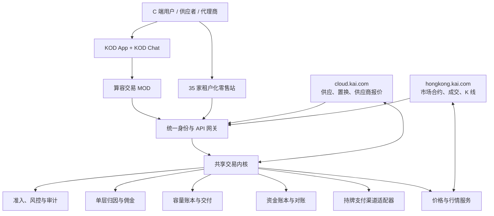
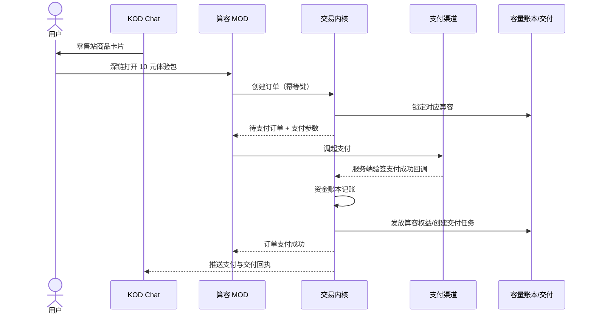

# KOD / MOD 算力交易平台架构 v0.1

更新时间：2026-08-04  
状态：业务架构草案，供老板、产品、支付、法务和研发共同评审

## 1. 一句话定义

把 KOD 作为统一用户与流量入口，把 MOD 做成 KOD 内可嵌入的算力交易应用；以一套共享交易内核连接 35 家零售站、cloud.kai.com 的供应与置换、hongkong.kai.com 的市场价格与 K 线，以及支付、交付、结算和单层代理返佣。

这不是把两个网站合并成一个页面，也不是开发 35 套独立商城，而是：

> 一套交易内核，四类前台，35 组租户配置。

## 2. 已确认事实与待确认假设

### 已确认

- `cloud.kai.com` 已有需求发布、算力置换、供应商报价和持久化后端，但尚无真实支付、资金结算和返佣闭环。
- `hongkong.kai.com` 已有模型容量合约、买入/卖出、持仓、限价/市价、成交记录和 K 线概念，但当前页面未发现充值、支付、提现、代理或返佣能力。
- 现有 KAI 供应商架构已把能力划分为销售、账单、风控等系统：销售系统拥有容量、挂牌、订单和交付；账单系统拥有收付款、对账和结算；渠道佣金限定为单层关系，禁止多层级返佣。
- 现有统一身份规范采用 OIDC，包含 `subject`、`org_id`、角色、独立 Client ID 和 PKCE 等基础能力。

### 待 KOD 团队确认

本文暂按以下工作假设设计，不把假设当成事实：

- KOD 是手机 App 容器，包含统一账号、KOD Chat、消息推送和深链能力。
- MOD 是可嵌入 KOD 的小应用、WebView 或原生模块。
- KOD 允许服务端换取短时登录凭证，并支持从 Chat 卡片打开指定 MOD 页面。
- KOD 的支付桥、分享卡片、消息回执、设备能力和审核规范尚未知。

必须由 KOD 团队补齐：MOD SDK、登录协议、Chat 卡片协议、深链协议、支付能力、消息回调、发布审核和灰度机制。

## 3. 先统一“算容”的业务含义

首版不把算容设计成货币、存款、股票或承诺收益的金融资产。

推荐定义：

> 算容是经过供应验证、具有模型/GPU、区域、时间窗口、SLA、计价单位和交付规则的算力服务容量，用户购买后获得可核验的服务使用权。

核心对象：

| 对象 | 含义 | 是否可以直接兑现金 |
| --- | --- | --- |
| 标准算容产品 `CapacityProduct` | 可比较的标准规格，例如某模型 100 万 Token、某 GPU 1 卡时 | 否 |
| 算容批次 `CapacityLot` | 供应商在特定时间和区域可交付的真实库存 | 否 |
| 算容权益 `Entitlement` | 买方已经购买、等待使用或正在使用的服务权利 | 首版否 |
| 置换单 `SwapOrder` | “我可提供 / 我需要”的双边容量交换意向 | 可有支付补差 |
| 市场合约 `MarketInstrument` | 用于报价、成交统计和 K 线的标准化标的 | 本身不是证券 |

“存入第一笔算容”应解释为供应方登记并验证一笔可售容量；“取出第一笔算容”应解释为撤回尚未锁定、尚未售出的容量。不要在首版使用类似资金钱包的“充值/提现”口径。

## 4. 五种机制方向与选择

| 方向 | 机制 | 主要问题 | 结论 |
| --- | --- | --- | --- |
| 1. cloud 全功能中心 | 行情、交易、支付、零售全部放在 cloud | B2B 行情和 C 端购买混在一起，入口过重 | 不选 |
| 2. hongkong 全交易所 | 把报价、K 线、下单、支付都放在 hongkong | 容易把服务交易做成类金融账户，且缺零售租户能力 | 不选 |
| 3. 35 套独立零售站 | 每家站独立开发后台、支付和返佣 | 重复开发、账不一致、风控失控 | 不选 |
| 4. 纯 Chat 商城 | 所有购买在聊天卡片中完成 | 无法承载库存、置换、交付和复杂对账 | 只作为入口 |
| 5. 共享交易内核 | KOD/MOD、零售站、cloud、hongkong 共用交易服务 | 需要先定义清晰系统边界 | 推荐 |

把三个可落地原型放进老板提出的硬约束后，结果如下（0=不满足，1=部分满足，2=满足）：

| 硬约束 | cloud 集中式 | 35 套独立站 | 共享内核 + 租户前台 |
| --- | ---: | ---: | ---: |
| KOD/MOD 可嵌入 | 1 | 1 | 2 |
| 35 家快速上线 | 1 | 0 | 2 |
| 订单与资金只有一本真账 | 2 | 0 | 2 |
| 价格发现与零售执行分离 | 0 | 1 | 2 |
| 每站一条真实 K 线 | 1 | 2 | 2 |
| 支付与返佣规则一致 | 2 | 0 | 2 |
| **适配总分** | **7/12** | **4/12** | **12/12** |

二次收敛时也比较了“先做算容钱包”和“逐单直接支付”。钱包看似能统一买卖和提现，但会立刻扩大资金账户、备付金、对账和用户资产风险；首版因此改为逐单直接支付 + 算容权益账本。等真实交易和合规边界稳定后，再评估是否需要由持牌合作方提供账户能力。

## 5. 推荐总体架构



### 四类前台职责

| 前台 | 主要用户 | 负责什么 | 不负责什么 |
| --- | --- | --- | --- |
| KOD / MOD | 手机 C 端、个人供应者、代理商 | 登录、浏览、购买、支付跳转、置换入口、分享、订单与佣金查询 | 不保存支付密钥，不自行记最终账 |
| 35 家零售站 | 各零售品牌的 C 端用户 | 一条主力 K 线、零售价、商品、活动、代理入口 | 不各自开发交易后台 |
| cloud.kai.com | 供应商、企业需求方、运营 | 供应报价、容量出售、置换、资源撮合、代理合作 | 不充当用户资金钱包 |
| hongkong.kai.com | 市场观察者、专业交易用户 | 标准合约、买卖深度、成交价格、历史 K 线 | 不单方面制定零售价，不直接保管用户资金 |

### 共享交易内核的九个服务

1. 产品与合约服务：统一 SKU、单位、区域、时间窗口、SLA 和交付规则。
2. 容量库存服务：登记、验证、锁定、释放、防超售。
3. 订单服务：购买、出售、撤销、退款和幂等状态机。
4. 置换服务：双边需求、匹配、估值、补差、双边锁定和原子交割。
5. 价格服务：参考价、供应报价、零售买卖价、价格保护和有效期。
6. 支付与清分适配器：创建支付、验签回调、退款、分账或结算指令。
7. 双账本：资金账本与容量账本分开记录、互相勾稽。
8. 代理与佣金服务：单层归因、佣金计提、退款冲正、结算。
9. 风控与审计服务：实名认证、商户/供应商准入、限额、异常交易和不可变事件。

## 6. 35 家零售站如何上线

35 家站点不是 35 个代码分支，而是 35 个 `tenant_id`：

```text
RetailTenant
├── tenant_id
├── 品牌与域名
├── 支付商户/子商户编号
├── 主力算容 SKU
├── 零售价格规则
├── 单层佣金计划
├── 可售区域与供应商池
├── 售后与发票主体
└── MOD 发布与灰度配置
```

每家站点可以拥有：

- 自己的品牌首页和一条主力算容 K 线；
- 自己的可执行买价、卖价和价差规则；
- 自己的直接代理商与佣金比例；
- 自己的支付商户或支付机构子商户配置；
- 自己的订单、客户、佣金和经营报表；
- 共享的商品、库存、订单、支付、风控和结算能力。

数据层所有业务表必须含 `tenant_id`，但容量批次、统一产品和平台行情允许受控共享。租户间不得直接查询对方客户、订单、佣金和支付信息。

## 7. 谁来制定算力价格

不建议由某个人或某个网站拍脑袋定价。价格应分四层：

1. **成本底座**：云厂商官方价、供应商可执行报价、税费、电费、网络和交付成本。
2. **参考市场价**：相同标准 SKU 的近期真实成交价优先，其次是可执行供应报价中位数，再其次是标准化官方价格。
3. **零售执行价**：零售站在参考价基础上加入支付成本、交付成本、风险准备和公开价差。
4. **人工兜底价**：仅在数据缺失或异常时使用，必须带审批人、原因、版本、有效期和偏离说明。

推荐价格优先级：

```text
相同 SKU 的新鲜真实成交 VWAP/TWAP
    ↓ 不足时
cloud 的可执行供应报价 P50
    ↓ 不足时
云厂商/模型厂商官方价标准化结果
    ↓ 仍不足时
限时人工基准价
```

`hongkong.kai.com` 负责展示市场成交、盘口和 K 线；`cloud.kai.com` 负责汇聚供应报价和资源可得性；价格服务把两者转换成可追溯参考价；每家零售站再按自己的定价规则生成实际可购买价格。

### 零售站的一条 K 线是什么

它不是“零售公司的股票 K 线”，而是该零售站某一个标准算容 SKU 的真实成交价格历史：

- 开：时间段第一笔成交价；
- 高：时间段最高成交价；
- 低：时间段最低成交价；
- 收：时间段最后一笔成交价；
- 量：该时间段真实成交的算容数量。

没有成交就显示“无成交”，不能用虚构数据补线。报价曲线和成交 K 线要明确区分。

## 8. 手机端关键旅程

### 8.1 从 KOD Chat 支付 10 元购买算容



关键规则：

- 前端“支付成功”页面不能作为到账凭证，必须以支付渠道服务端验签回调为准。
- 支付回调、订单创建、容量发放和佣金计提都必须幂等。
- 支付成功但发放失败时进入可重试补偿队列，不能重复扣款或重复发放。
- 首版直接按订单支付，不做 KAI 自建余额账户，不沉淀用户资金。

### 8.2 用户如何进入算容置换

MOD 首页提供三个一级动作：

```text
10 元试买 | 存入/出售算容 | 置换算容
```

置换流程：

1. 用户选择“我可提供”的算容批次；没有批次先走存入与验证。
2. 用户填写“我需要”的模型/GPU、地区、时间和数量。
3. 价格服务给出双方参考价值与可选补差。
4. 平台匹配对手方，双方确认后锁定两边容量。
5. 如需补差，调起 10 元或其他金额支付。
6. 支付成功后原子交换两边权益；任一步失败则全部释放。
7. 双方获得交割回执，订单进入结算与审计。

首批真实交易采用人工撮合、系统锁定和双人复核；等规则稳定后再自动撮合。

### 8.3 用户如何存入和取出第一笔算容

存入：

1. 完成身份或供应主体认证。
2. 选择标准产品，填写区域、时间窗口、数量和 SLA。
3. 提交可交付证明或接入验证端点。
4. 系统检测后生成 `CapacityLot`，状态从 `pending_validation` 进入 `available`。
5. 容量账本增加可售数量，但不产生现金余额。

取出：

1. 用户选择尚未成交的容量批次。
2. 系统检查没有订单锁定、置换锁定、交付义务和风险冻结。
3. 通过后把状态改为 `withdrawn` 并减少可售数量。
4. 已售权益不能“取出”，只能按合同走撤销、退款或履约替代。

### 8.4 用户如何成为代理商并推荐好友

1. 用户申请成为直接代理，完成身份、协议、税务和收款资料。
2. 系统生成该零售站下的唯一 `agent_code`。
3. 用户分享带签名的 KOD Chat 商品卡片；卡片只带租户、商品、活动和代理归因，不带敏感数据。
4. 好友通过卡片打开 MOD，订单创建时固化一个直接代理归因。
5. 支付成功不立即可提现；交付完成且退款观察期结束后才计为可结算佣金。
6. 退款、撤销或欺诈订单自动冲正佣金。

只支持一层直接推荐：A 推荐 B 的订单，A 获得佣金；B 再推荐 C 时，B 可获得 C 订单佣金，A 不从 C 的订单获得二级佣金。

## 9. 100 元订单如何拆账

首个内地 C 端试点建议把金额明确写成 `CNY 100.00` 或 `CNY 10.00`。`hongkong.kai.com` 若使用 HKD，其行情不能与 CNY 订单静默混用；价格换算必须记录汇率来源、汇率时间、原币价格和目标币价格。

100 元支付不是直接等于平台收入。账本至少拆成：

```text
客户实付 100.00
= 供应商应付
+ 零售站毛利
+ 平台服务费
+ 直接代理佣金
+ 支付通道费
+ 税费/风险准备或舍入差额
```

每个分录必须满足：借贷平衡、订单可追踪、支付流水唯一、退款可逆转、佣金可冲正、供应商结算可对账。

支付接入支持两种商户模式，但首批只能选定一种：

- 平台作为销售主体：平台收款，履约后向供应商和代理结算；
- 零售站作为子商户：支付机构按合规产品进行分账或结算。

无论哪种模式，都应使用持牌支付机构或银行提供的正式产品，KAI 系统只保存支付订单号、金额、状态和脱敏凭证，不自行经营支付账户。

## 10. 状态机和核心事件

### 订单状态

```text
created
→ capacity_reserved
→ pending_payment
→ payment_succeeded
→ fulfillment_pending
→ delivered
→ settlement_pending
→ settled
```

异常分支：`payment_failed`、`expired`、`cancelled`、`refund_pending`、`refunded`、`delivery_failed`、`risk_held`。

### 关键事件

- `order.created`
- `capacity.reserved`
- `payment.succeeded`
- `payment.failed`
- `entitlement.issued`
- `delivery.completed`
- `swap.matched`
- `swap.settled`
- `commission.accrued`
- `commission.reversed`
- `settlement.paid`
- `refund.completed`

所有跨系统写入采用事务事件盒（outbox）、全局 `event_id`、幂等键、版本号和审计时间，不允许靠页面跳转判断交易状态。

## 11. KOD / MOD 集成契约

### 深链示例

```text
kod://mod/compute-trade
  ?tenant_id=retail_001
  &product_id=capacity_sku_001
  &campaign_id=campaign_202608
  &agent_code=agent_xxx
  &expires_at=...
  &signature=...
```

深链不得包含用户姓名、手机号、支付凭证或可直接复用的登录 Token。

### 登录

- KOD 通过 OIDC Authorization Code + PKCE 打开 MOD。
- MOD 后端校验 `iss`、`aud`、`exp`、`nonce` 和签名。
- 业务上下文最少包含 `subject`、`org_id`、`tenant_id` 和角色。
- MOD 只使用短时会话，支付密钥和供应商密钥仅存在服务端。

### MOD 最小页面

1. 零售站首页：一条 K 线、实时买卖价、三个主动作。
2. 10 元体验包详情与确认订单。
3. 支付结果与交付凭证。
4. 我的算容：可用、锁定、已使用、已撤回。
5. 置换：我可提供 / 我需要 / 补差。
6. 成为代理商、分享卡片、佣金明细。
7. 我的订单、退款与客服。

## 12. 第 10 笔真实交易与 5000 元奖金

5000 元作为里程碑奖金可以，但不应只奖励“出现第 10 个支付成功页面”，否则容易诱发内部自买、跳过对账或手工改数据。

推荐奖金触发条件：

- 同一试点版本连续完成 10 笔真实订单；
- 付款人为真实、独立用户，不能由项目组循环自买；
- 每笔金额至少 10 元，支付渠道真实扣款；
- 服务端支付回调验签成功且只处理一次；
- 每笔都完成容量锁定、权益发放或交付证明；
- 每笔资金账与容量账都平衡；
- 第 10 笔完成后 72 小时对账无未解释差异；
- 另行跑通一次支付失败和一次退款/佣金冲正；
- 不允许直接修改生产数据库补状态。

验收结果不是“页面显示成功”，而是以下链路全部为真：

```text
真实付款
→ 支付渠道到账
→ 服务端验签
→ 订单成功
→ 算容交付
→ Chat 回执
→ 账本平衡
→ 供应商应付
→ 代理佣金计提/冲正正确
→ 对账通过
```

## 13. 分阶段上线

### P0：KOD 能力核对（1 周内）

- 明确 MOD 容器、登录、深链、支付桥和消息协议。
- 明确首批销售主体、支付商户和发票主体。
- 明确首个真实算容 SKU 和供应商。

### P1：第 10 笔闭环试点

- 1 家零售站、1 个 MOD、1 个算容 SKU；
- 1 家供应商、1 个支付渠道、1 套固定且有有效期的价格；
- 10 元体验包；
- 不做余额、提现、C2C 二级转卖和自动撮合；
- 置换可先人工匹配、系统留痕；
- 完成 10 笔真实交易验收。

### P2：3 家零售站

- 验证多租户隔离；
- 上线单层代理返佣；
- 每家站一条真实成交 K 线；
- 引入 cloud 供应报价和 hongkong 参考成交价。

### P3：35 家零售站

- 站点开通改为配置化；
- 每站独立支付商户/子商户、价格、佣金和报表；
- 自动对账、批量结算、异常告警和灰度发布。

### P4：受控开放 C 端出售与自动置换

- 只允许可验证的真实容量进入出售；
- 对用户已购权益的二级转让、做市和现金回购先完成专项法务、税务和监管评估；
- 通过限额、冷静期、价格保护和异常交易检测后再放量。

## 14. 首批团队建议

这不是前端项目，建议按一条交易链组建小组：

| 角色 | 首批责任 |
| --- | --- |
| 产品/业务负责人 | 标准 SKU、合同、售价、退款和第 10 笔验收 |
| KOD/MOD 负责人 | 登录、Chat 卡片、深链、支付结果与消息回执 |
| 交易后端负责人 | 订单、容量、置换、状态机和事件 |
| 支付/账务负责人 | 支付验签、双账本、退款、对账和结算 |
| 供应/交付负责人 | 真实库存、验证、锁定、交付证明 |
| 风控/法务 | 销售主体、支付、返佣、二级转让和用户协议 |
| 测试/审计 | 十笔真实交易证据与异常场景 |

## 15. 架构红线

- 不自建用户资金余额或允许“充值后等待升值”。
- 不把算容描述为保本、收益或股票类资产。
- 不允许同一容量重复挂牌或超售。
- 不允许多层级返佣、入门费或按发展人数计酬。
- 不相信前端支付成功页，只相信服务端验签回调和对账。
- 不让 35 家零售站各自维护一套订单和佣金真相。
- 不生成虚假成交或虚假 K 线。
- 不在没有法务与持牌合作方评估时开放自由提现、二级转卖或自动做市。

## 16. 下一次评审只需回答的十个问题

1. KOD 和 MOD 的官方定义、SDK 和发布流程是什么？
2. KOD Chat 能否发送带签名深链的商品卡片？
3. KOD 是否已有统一支付桥？支持哪些商户和服务端回调？
4. 首笔 10 元订单由谁作为销售主体、开票主体和退款主体？
5. 第一款真实算容商品是什么，交付证据是什么？
6. 第一家真实供应商是谁，如何证明不超售？
7. 35 家零售站是独立公司、内部渠道还是加盟商？
8. 代理是个人、企业还是两者都有，佣金如何完税？
9. 用户“卖出”指卖自己的真实计算能力，还是转卖已购服务权益？
10. hongkong 的成交数据是真实交易、模拟盘还是报价演示？

这十个答案一旦确定，架构可进入接口清单、数据模型和 P1 排期。

## 17. 监管参考

- [中国人民银行：《非银行支付机构监督管理条例》](https://www.pbc.gov.cn/tiaofasi/144941/144953/5174993/index.html)
- [国家市场监督管理总局：禁止传销工作概述](https://www.samr.gov.cn/jjj/gfzxydjcx/art/2023/art_dbbbb9d0569f4fffb8210749e8c5819d.html)

本文不是法律意见。真实支付、分账、返佣、二级转让和跨境交易上线前，需由公司法务、税务、支付合作方和适用地区的专业顾问确认。
